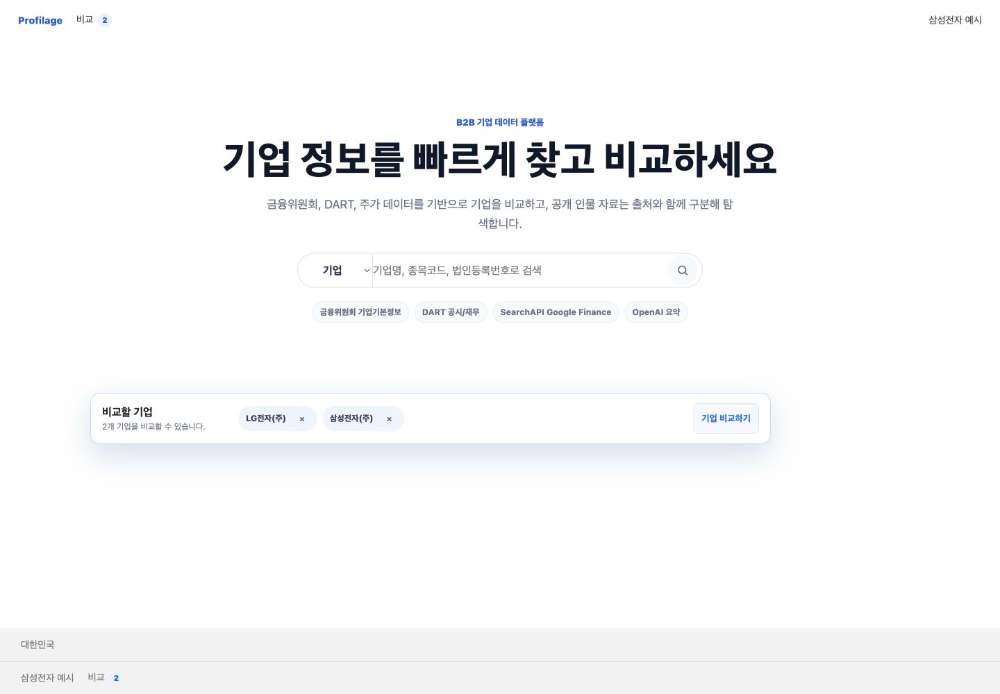
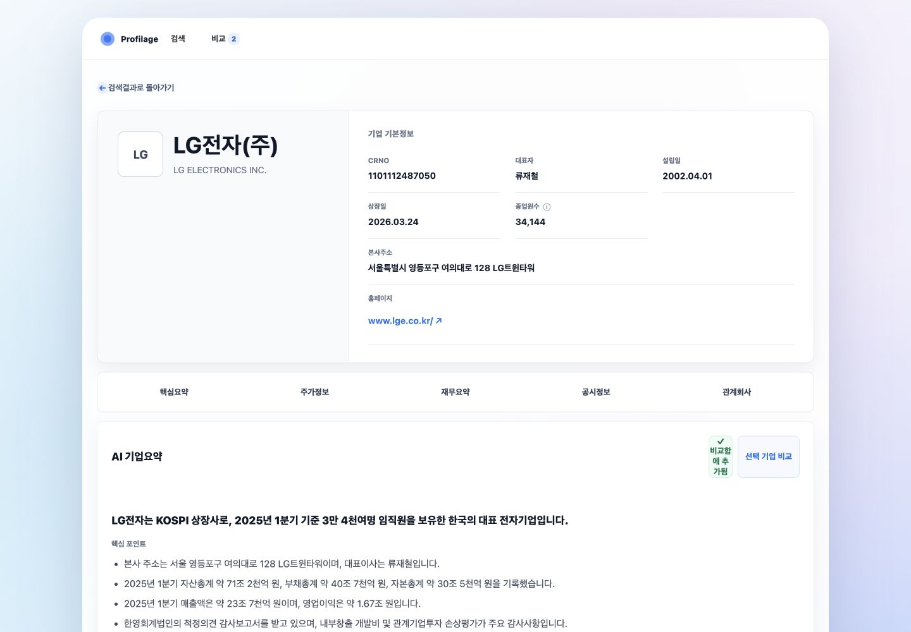

# 배포 UI 여백·정렬 개선 계획

- 점검일: 2026-07-11
- 대상: `https://profile.fin-ally.net/`
- 범위: 메인 페이지, 기업정보 페이지
- 기준 화면: 데스크톱 1440 × 1000
- 점검 방식: 배포 화면 캡처, DOM 구조 확인, 실제 CSS 레이아웃 값과 저장소 스타일 규칙 대조

## 1. 결론

현재 화면은 기능과 정보 구조는 정상이나, **메인 페이지의 과도한 수직 여백**과 **기업정보 페이지의 불균형한 상단 카드 비율·정보 밀도** 때문에 각 요소가 서로 따로 노는 인상을 준다. 공통 컨테이너·간격 규칙이 화면별로 다르고, 기업정보 상단은 과거 스타일 위에 추가된 재정의가 겹쳐 있어 수정 시 예측 가능성도 낮다.

우선순위는 다음과 같다.

1. 공통 콘텐츠 폭과 좌우 거터를 토큰화한다.
2. 메인 첫 화면의 수직 리듬을 다시 잡는다.
3. 기업정보 상단 카드를 콘텐츠 높이에 맞추고 좌우 비율을 조정한다.
4. 섹션 탭과 본문 카드의 간격·정렬 기준을 통일한다.
5. 중복 CSS를 정리한 뒤 1440/1024/768/390px에서 회귀 검증한다.

## 2. 캡처 화면

### Step 1 — 메인 페이지



- 상태: **보통 — 기능은 명확하지만 화면 높이 대비 콘텐츠 배치가 느슨함**
- 강점: 제목, 검색창, 데이터 출처, 비교함의 우선순위는 이해하기 쉽다.
- 문제: 헤더 아래부터 검색 영역까지, 비교함 아래부터 푸터까지 빈 공간이 지나치게 크다. 검색 본체는 584px, 비교함은 980px이라 주요 요소의 왼쪽·오른쪽 기준선도 맞지 않는다.
- 문제: 상단 내비게이션과 푸터 콘텐츠가 화면 끝에 붙어 있는 반면 본문은 중앙의 좁은 영역에 모여 있어 하나의 레이아웃 시스템처럼 보이지 않는다.
- 문제: `min-height: 48vh`와 `padding-top: 76px`가 동시에 적용되어 화면 높이에 따라 제목 블록이 필요 이상으로 아래로 밀린다.
- 접근성 위험: 회색 부제·푸터·데이터 출처 배지의 명도 대비는 별도 색상 대비 측정이 필요하다. 검색 아이콘 버튼은 시각적으로 작아 보이므로 실제 44px 터치 영역 유지 여부를 검증해야 한다.

### Step 2 — 기업정보 페이지



- 상태: **보통 이하 — 정보는 풍부하지만 상단 비율과 액션 배치가 불안정함**
- 강점: 기업명 → 기본정보 → 섹션 탭 → 상세 콘텐츠 순서는 명확하며, 공통 카드 경계도 일관적이다.
- 문제: 상단 기업 식별 영역은 실제 콘텐츠보다 높아 큰 빈 면적이 생긴다. 반대쪽 기본정보는 같은 높이를 채우느라 항목 간 세로 간격이 커져 한 카드 안의 밀도가 서로 다르다.
- 문제: 상단 그리드가 `.54fr / 1fr`로 고정되어 기업명 영역은 좁고 기본정보 영역은 넓다. 긴 기업명에서는 제목 줄바꿈이 빨리 발생하고, 짧은 기업명에서는 왼쪽이 비어 보인다.
- 문제: 섹션 탭은 카드 폭 전체에 균등 분배되어 개별 탭 사이가 멀고 현재 위치 표시가 약하다. 탭 아래 본문과의 16px 안팎 간격도 상단 카드의 큰 여백과 대비되어 리듬이 끊긴다.
- 문제: AI 요약 카드 우측 액션이 좁은 열에 쌓이며 `비교함에 추가됨` 문구가 여러 줄로 압축된다. 제목과 액션을 같은 행에 두되 액션 최소 폭을 보장해야 한다.
- 접근성 위험: 현재 탭은 링크 목록으로 보이며 활성 섹션을 색상 외 방식과 `aria-current`로 전달하는지 확인이 필요하다. 작은 정보 라벨과 보조 텍스트는 대비 측정이 필요하다.

## 3. 원인 분석

### 공통

- 메인은 `.shell` 1180px, 검색창 584px, 비교함 980px을 각각 사용하고 기업정보는 `.company-canvas` 1180px 안에서 다시 44px 거터를 뺀다. 화면별 기준선이 달라 정렬이 미묘하게 어긋난다.
- 8px 단위의 공통 spacing scale 없이 14, 18, 22, 28, 30, 32, 44, 54, 76px 등이 개별 선언되어 수직 리듬이 일정하지 않다.
- `styles.css` 후반부에서 `.profile-top-grid`, `.profile-hero`, `.profile-basic-card`를 다시 선언한다. 앞선 규칙과 후반 override가 공존해 변경 영향 범위를 파악하기 어렵다.

### 메인

- `.search-panel`의 `min-height: 48vh`, `justify-content: center`, `padding-top: 76px` 조합이 빈 공간을 만든다.
- 비교함은 본문 폭보다 작고 검색창보다 커서 세 개의 다른 수평 기준선이 동시에 보인다.
- 푸터가 화면 하단에 고정된 듯 보이지만 본문과 연결되는 구분·간격 체계가 약하다.

### 기업정보

- `.profile-hero`의 `min-height: 310px`가 콘텐츠 높이와 무관하게 빈 공간을 강제한다.
- 상단 카드가 `align-items: stretch`로 동작해 기본정보 높이가 기업 식별 영역에 종속된다.
- `.profile-basic-grid`는 3열이지만 주소·홈페이지가 전체 폭을 차지해 행별 밀도 차이가 크다.
- 회사 캔버스와 내부 셸이 각각 44px을 감산하여 외곽과 내부 거터가 중첩된다.

## 4. 개선 설계

### 4.1 공통 레이아웃 토큰

`styles.css` 상단에 다음 역할의 변수를 정의한다.

```css
:root {
  --layout-max: 1180px;
  --layout-gutter: clamp(16px, 3vw, 32px);
  --section-gap: clamp(16px, 2vw, 24px);
  --card-padding: clamp(20px, 2.4vw, 32px);
  --space-1: 4px;
  --space-2: 8px;
  --space-3: 12px;
  --space-4: 16px;
  --space-6: 24px;
  --space-8: 32px;
  --space-12: 48px;
}
```

- `.shell`, `.company-canvas`, `.profile-shell`이 같은 `--layout-max`와 `--layout-gutter`를 사용하도록 통일한다.
- 같은 계층의 카드 패딩은 24px 또는 32px 중 하나로 정리한다.
- 임의값은 남기지 말고 spacing scale로 치환한다.

### 4.2 메인 페이지

1. `.search-panel`의 `min-height`를 제거하거나 `clamp(360px, 44vh, 500px)`로 제한한다.
2. 상단 패딩은 76px에서 40~56px 범위로 낮춘다.
3. 검색창은 데스크톱에서 640~680px로 확장해 제목·부제와 시각적 폭을 맞춘다.
4. 비교함은 검색 블록과 동일한 최대 폭을 사용하거나, 본문 980px 그리드에 맞춘다면 검색 블록도 같은 기준선으로 정렬한다.
5. 비교함 위 여백은 48~64px, 아래 여백은 32~48px로 명시하여 가운데 떠 있는 느낌을 줄인다.
6. 헤더·푸터도 본문과 같은 컨테이너 안에 넣어 좌우 기준선을 맞춘다.
7. 푸터의 높이와 링크 간격을 줄이고 상단 경계선 대비를 낮춰 보조 영역임을 분명히 한다.

### 4.3 기업정보 페이지

1. `.profile-hero`의 `min-height: 310px`를 제거하고 콘텐츠 기반 높이로 바꾼다.
2. 상단 비율을 `.8fr / 1.2fr` 또는 `minmax(360px, .8fr) minmax(0, 1.2fr)`로 조정한다.
3. 기업명 영역은 상하 28~32px 패딩으로 제한하고 로고와 제목을 세로 중앙 정렬한다.
4. 기본정보는 3열을 유지하되 주소·홈페이지를 별도의 2열 하단 행으로 묶어 행 밀도를 맞춘다.
5. 탭 바는 `position: sticky` 적용 여부를 검토하고, 활성 탭에 하단 2px 인디케이터와 `aria-current="location"`을 제공한다.
6. 상세 카드 간 간격을 16px 또는 24px 하나로 통일한다.
7. AI 요약 헤더는 `grid-template-columns: minmax(0, 1fr) auto`로 구성하고, 액션 그룹에 `flex-shrink: 0`과 최소 44px 높이를 준다.
8. `비교함에 추가됨`은 좁은 배지 대신 체크 아이콘 + 짧은 `추가됨` 라벨로 줄이고, 전체 설명은 접근 가능한 이름으로 유지한다.
9. 후반부의 중복 `.profile-*` override를 최종 규칙 한 군데로 병합한다.

### 4.4 반응형

- 1024~821px: 상단 기업정보 2열을 유지하되 좌측 최소 320px 보장.
- 820px 이하: 상단을 1열로 전환하고 기업명 영역과 기본정보 사이 구분선을 수평으로 변경.
- 560px 이하: 기본정보를 2열, 360px 이하에서는 1열로 전환. 단, 주소·홈페이지는 항상 전체 폭.
- 메인 검색창은 560px 이하에서 검색 유형 선택과 입력 영역을 2행으로 분리해 텍스트가 눌리지 않도록 한다.
- 비교함은 820px 이하에서 1열로 전환하되, 목록이 길어지면 최대 높이와 내부 스크롤을 둔다.

## 5. 구현 순서

### Phase 1 — CSS 구조 정리

- 공통 토큰 추가.
- `.profile-*` 중복 선언을 통합하고 cascade 의존 제거.
- 변경 전 주요 클래스의 시각 회귀 캡처 확보.

### Phase 2 — 메인 수직 리듬 수정

- 검색 패널 높이·상단 패딩·본문 폭 조정.
- 검색창, 출처 배지, 비교함의 중심선과 최대 폭 통일.
- 헤더·푸터 거터 정렬.

### Phase 3 — 기업정보 상단 및 액션 수정

- 상단 카드 높이·열 비율·기본정보 그리드 수정.
- 탭 활성 상태 및 본문 카드 간격 통일.
- AI 요약 액션 그룹의 줄바꿈 방지.

### Phase 4 — 반응형·접근성 검증

- 1440, 1024, 820, 768, 560, 390px 캡처 비교.
- 200% 확대에서 가로 스크롤과 콘텐츠 겹침 확인.
- 키보드 포커스 순서, 탭 활성 상태, 정보 툴팁, 비교함 제거 버튼 확인.
- 텍스트/아이콘 대비를 WCAG AA 기준으로 측정.

## 6. 완료 기준

- 메인 제목·검색창·출처·비교함이 하나의 수평 기준선 체계에 놓인다.
- 1440 × 1000 첫 화면에서 검색과 비교함이 과도한 빈 공간 없이 함께 인지된다.
- 기업정보 상단 카드에 의미 없는 100px 이상의 빈 세로 공간이 남지 않는다.
- 긴 기업명, 긴 주소, 4개 비교 항목에서도 겹침이나 비정상 줄바꿈이 없다.
- 390px에서 가로 스크롤이 발생하지 않는다.
- 모든 주요 버튼/링크의 포인터 영역이 최소 44 × 44px이다.
- 키보드만으로 검색, 비교함, 프로필 탭, 요약 액션을 사용할 수 있다.
- 시각 회귀 캡처에서 좌우 거터와 카드 간격이 breakpoint별로 일관된다.

## 7. 증거 한계

- 이번 평가는 캡처 화면과 DOM/CSS 구조를 바탕으로 한 시각·구조 감사다.
- 모바일 캡처는 브라우저 캡처 연결이 불안정해 최종 증거 이미지로 채택하지 않았으며, 모바일 평가는 현재 미디어쿼리 구조를 바탕으로 계획만 제시했다.
- 스크린리더 읽기 순서, 실제 색상 대비 수치, 200% 확대, 키보드 포커스 이동은 구현 단계에서 별도 검증해야 한다.
