# 기업·인물 통합 검색 기능 설계 및 구현 계획

> 작성일: 2026-07-11<br>
> 대상 저장소: Profilage (`FastAPI + vanilla JavaScript + PostgreSQL + Valkey`)<br>
> 문서 성격: 제품·UX·백엔드·데이터·LLM·운영 구현안<br>
> 2026-07-11 보완: 사용자 명시 동작 기반의 단일 페이지 분석과 제한된 headless fallback 추가<br>
> 관련 문서: `docs/superpowers/plans/2026-07-06-people-search-ready-ux-design-plan.md`

이 문서는 기존의 “인물 검색 준비 UX” 계획을 실제 외부 검색, 동명이인 식별, 근거 기반 LLM 분석, 개인정보 보호까지 포함하는 구현안으로 확장한다.

법률 자문 문서는 아니다. 다만 인물 데이터는 기업 데이터보다 위험도가 높으므로, 아래의 소셜 데이터 범위와 보존 정책은 출시 전에 개인정보·플랫폼 약관 검토를 거쳐야 한다.

---

## 0. 결론

### 권장 제품 범위

첫 화면의 검색창은 그대로 하나만 유지하고, 검색창 왼쪽에 `기업 / 인물` 드롭다운을 추가한다. 사용자가 요청한 것처럼 같은 페이지 안에서 모드만 바꾸는 방식이다.

인물 기능은 다음 세 단계로 분리한다.

1. **후보 검색**: 이름, 소속, 직책으로 동명이인 후보와 공개 출처를 찾는다.
2. **사용자 주도 단일 페이지 분석**: 사용자가 특정 결과에서 `이 페이지 분석`을 명시적으로 실행한 경우, 정책상 허용된 현재 페이지 한 건만 일회성으로 요약한다.
3. **선택한 인물 분석**: 사용자가 후보를 확인하고 처리 근거가 검증된 뒤에만 여러 출처를 결합한 인물 프로필과 LLM 요약을 생성한다.

검색과 동시에 모든 소셜 계정과 게시물을 수집하면 속도, 비용, 동명이인 오병합, 개인정보 위험이 모두 커진다. 따라서 후보 선택 전에는 비싼 본문 추출과 LLM 호출을 하지 않는다.

단일 페이지 분석은 이 원칙의 좁은 예외다. 이름 검색만으로 자동 실행하지 않고, 한 번의 사용자 동작마다 한 URL만 처리하며, 결과도 기본적으로 해당 세션에서만 보이는 `page preview`로 남긴다. 이 preview는 자동으로 인물 프로필에 합쳐지지 않는다.

### 권장 검색 공급자 구성

`SearchAPI`와 `Tavily` 중 하나를 고르는 방식보다 역할을 분리하는 것이 좋다.

- **SearchAPI Google**: 인물·공식 페이지·소셜 URL 후보 발견, Google Knowledge Graph, 지역·언어 조정
- **Wikipedia/MediaWiki 및 Wikidata API**: 유명 인물의 구조화된 식별자와 백과 정보
- **기존 DART on-demand 조회 + 주주 인덱스**: 국내 기업인의 seed 데이터. 이름 검색용 임원 mention index는 새 배치로 구축
- **Tavily Search/Extract**: 사용자가 확정한 인물에 대해 이용이 허용된 공개 웹 문서의 관련 본문만 추출
- **Profilage Browser Companion**: 사용자가 현재 탭에서 직접 실행했을 때만, 허용된 도메인의 렌더링된 본문을 최소 범위로 전달
- **격리된 headless browser worker**: 일반 HTTP/Tavily 추출이 실패한 허용 공개 JS 페이지의 렌더링 fallback. 로그인·CAPTCHA·차단 우회에는 사용하지 않음
- **기존 OpenAI 기반 요약 계층**: 출처가 연결된 사실·공개 발언·반복 주제 요약

즉, 기존 SearchAPI를 Tavily로 교체하지 않는다. SearchAPI는 발견 계층으로 유지하고 Tavily를 **선별된 공개 웹 문서의 추출 계층**으로 추가한다.

### 반드시 제한할 범위

`이름 검색 → 임의 일반인의 LinkedIn/Facebook/Instagram 전체 수집 → 숨은 성격·생각 추론`을 기본 기능으로 만들면 안 된다.

- 공적 인물 또는 업무상 공개 역할이 확인된 사람은 공식 자료, DART, 위키, 언론 인터뷰, 공식 홈페이지를 중심으로 요약한다.
- 일반인에 대해서도 사용자가 명시적으로 선택한 **허용 페이지 한 건의 내용**은 처리 목적·도메인 정책을 통과한 경우 session-only page preview로 분석할 수 있다.
- page preview는 `이 페이지에서 확인되는 사실·직접 표현·주제`만 말하며, 여러 페이지를 자동 결합하거나 개인 dossier·성향 보고서로 확장하지 않는다.
- 여러 소셜 페이지를 인물 프로필에 누적하거나 장기 보존하려면 플랫폼이 승인한 self-data API scope·본인 export·본인 확인·정보주체 동의, 또는 별도로 승인된 목적별 처리 근거와 source 사용 권한이 필요하다.
- LinkedIn과 Meta는 사용자가 클릭했더라도 브라우저 확장·headless 수집 권한이 자동으로 생기지 않는다. official API 승인은 DOM 수집 권한과 분리하며, direct-link display와 web capture도 각각 승인되지 않으면 domain-only 상태만 제공한다.
- “성격”이나 “속마음” 대신 `확인된 사실`, `본인이 공개적으로 밝힌 입장`, `공개 활동에서 반복적으로 다룬 주제`를 보여준다.
- 정치성향, 종교, 건강, 성적 지향, 인종·민족, 정신 상태, 범죄 가능성 등 민감한 속성은 추론하지 않는다.

검색 API가 페이지를 기술적으로 반환할 수 있다는 사실은 해당 플랫폼 콘텐츠를 수집·저장·분석할 권한을 뜻하지 않는다.

---

## 1. 현재 코드에서 재사용할 수 있는 것

| 현재 자산 | 위치 | 인물 기능에서의 사용 |
|---|---|---|
| 홈 검색 폼 | `app/static/index.html` | 검색창 안에 모드 드롭다운 추가 |
| 검색 상태·결과 렌더링 | `app/static/app.js` | `searchState.type`, 인물 loader/renderer 추가 |
| 공통 결과 클래스 | `entity-result-row`, `entity-type-badge` | 기업·인물 공통 row 골격으로 재사용 |
| DART 임원 조회 | `app/services/company_dart.py` | 회사에서 인물로 이어지는 seed 데이터. `employees`는 부문·성별 집계이므로 인물 후보로 사용하지 않음 |
| 주주 이름 검색 | `app/services/company_shareholders.py` | 후보 소속·보유 관계 신호로만 사용 |
| SearchAPI 설정 | `app/core/config.py` | 기존 `SEARCHAPI_API_KEY` 재사용 |
| SearchAPI HTTP 패턴 | `CompanyStockPriceService` | 호출·오류·캐시 패턴 참고. 클래스 자체는 확장하지 않음 |
| 데이터 그룹 캐시 | `app/services/company_store.py` | 공적 출처의 provider 응답·요약 캐시. 현재 TTL은 물리 삭제가 아니므로 purge 보완 전 일반인 raw data에는 사용하지 않음 |
| Valkey JSON 캐시 | `app/services/cache.py` | 짧은 sanitized 검색 cache에 참고. one-time candidate token에는 기능이 부족하므로 전용 store 필요 |
| LLM 요약·fingerprint | `company_profile_summary.py`, `company_disclosure_summary.py` | 인물 source snapshot → fingerprint → JSON → cache 패턴 |
| 프로필 skeleton UI | `profile.html`, `profile-page-5.js` | 인물 상세의 로딩·출처·요약 패턴 참고 |

### 그대로 재사용하면 안 되는 부분

현재 `shareholder_entity_id()`는 영속 식별자가 없을 때 정규화된 이름을 해시한다. 따라서 같은 이름의 서로 다른 사람이 같은 ID로 묶일 수 있다. 이 값은 검색 신호로는 쓸 수 있지만 인물 canonical ID로 사용하면 안 된다.

현재 DART people 공개 응답에는 `birth_ym`, `sexdstn`이 포함될 수 있다. 인물 검색의 public serializer에서는 생년월, 성별, 개인 연락처, 주소를 기본 제외해야 한다.

현재 DART 연동은 `corp_code → 해당 회사의 임원` 조회이지 `이름 → 모든 회사의 임원` 전역 검색이 아니다. `employees` 응답도 개인 목록이 아니라 부문·성별 인원 집계다. 인물 검색에 DART를 쓰려면 상장사 또는 정한 회사 corpus를 순회해 임원 mention을 별도 `dart_person_mentions`에 미리 색인하는 배치가 필요하다. 이 mention은 동일인 확정 전의 원천 occurrence이며 canonical `person_roles`가 아니다. 기존 `shareholder_entities`도 sync/index 작업이 실행된 corpus 안에서만 검색 가능하다.

`profile-page-5.js`와 `styles.css`는 이미 매우 크다. 인물 페이지 코드를 여기에 이어 붙이지 말고 별도 파일로 만든다.

현재 인증 helper는 JWT가 유효한지 boolean으로만 판단하고 사용자 `sub`, tenant, role을 반환하지 않는다. 인물별 동의, 정정 요청, 사용자 quota, 관리자 색인 job을 구현하려면 `AuthContext(user_id, tenant_id, roles)`를 반환하는 인증 dependency가 먼저 필요하다.

현재 `JsonCache` interface에는 one-time consume, delete, TTL 조회가 없고 Valkey 미설정 시 `NullJsonCache`가 조용히 동작한다. candidate token은 이 abstraction에 넣지 말고, 장애·미설정 시 503을 반환하는 전용 `CandidateStore`를 사용해야 한다.

---

## 2. 제품 정책과 처리 모드

사용자에게 보이는 검색 종류는 `기업 / 인물` 두 개면 충분하다. 다만 백엔드는 인물의 처리 가능 범위를 다음처럼 구분해야 한다.

여기서 LIA는 `Legitimate Interests Assessment`, 즉 처리 목적·필요성과 정보주체 권리를 비교형량해 문서화한 정당한 이익 평가를 뜻한다.

| 내부 처리 모드 | 조건 | 허용 범위 |
|---|---|---|
| `public_role` | 위키·Wikidata, DART 임원, 공직, 공식 회사/기관 소개 등 공적 역할이 확인됨 | 분류 신호일 뿐 허가가 아님. 승인된 목적별 processing basis/LIA가 있을 때만 허용 claim 범위 요약 |
| `consented` | 승인된 self-data API 연결, 본인 확인, 또는 기록 가능한 동의가 있음 | 동의와 플랫폼 승인 scope 안의 공식 API 데이터·본인 제공 자료 분석 |
| `discovery_only` | 공적 역할·동의가 확인되지 않음 | 후보 이름, 소속 단서, 외부 링크 표시. 정책상 허용된 URL은 별도 session-only `page_preview`로만 분석 가능 |
| `blocked` | 미성년자, 비공개 계정, 민감·괴롭힘 목적, 접근 우회 필요 | 검색·분석 중단 |

`유명인 / 일반인`이라는 값을 사용자에게 낙인처럼 표시하지 않는다. 내부의 `source_strategy`와 `policy_mode`로만 사용한다. 유명인이라는 이유도 개인정보 보호의 포괄적 예외가 되지 않는다.

인물의 처리 모드와 분석 결과의 범위는 별도 축으로 관리한다.

| 분석 범위 | 저장·표시 범위 | 허용 조건 |
|---|---|---|
| `page_preview` | 현재 사용자만 보는 한 페이지 요약. 정제 원문 15분, 결과 1시간 TTL | 인증 principal + 명시적 user gesture + 허용 domain/source policy + 승인된 목적 |
| `profile_evidence` | 확인된 person에 연결되는 최소 evidence | 동일인 확인 + 처리 근거/동의 + source 사용 권한 + 사용자 검토 |
| `profile_synthesis` | 여러 evidence를 결합한 인물 요약 | materialized person + claim scope + 최소 근거 수 충족 |

`page_preview`가 성공했다는 사실만으로 `profile_evidence`나 `profile_synthesis`로 승격하지 않는다.

### MVP에 포함

- 기업/인물 검색 모드 전환
- 이름 + 소속/직책을 이용한 동명이인 후보 검색
- Wikipedia/Wikidata, DART, 공식 홈페이지, 신뢰 가능한 언론·인터뷰 출처
- 후보 확인 후 인물 상세 프로필 생성
- 검색 결과의 허용 공개 페이지에 대한 사용자 주도 단일 페이지 분석
- Chrome `activeTab` 기반 Browser Companion과 공개 JS 페이지용 격리 headless fallback의 정책·기술 기반
- 확인된 역할·경력, 공개 발언, 반복 주제의 출처 기반 요약
- 문장 또는 항목별 근거 URL·날짜·신뢰 상태
- 정정·삭제·검색 제외 요청 경로

### MVP에서 제외

- 비공개 계정, 로그인 뒤 제3자 콘텐츠, 친구 공개 게시물의 자동 캡처
- CAPTCHA, rate limit, robots, 접근 통제 우회
- headless stealth plugin, proxy rotation, cookie/session 주입, 사용자 브라우저 cookie 업로드
- 이름만 같은 계정을 자동으로 한 사람으로 병합
- 얼굴 인식 또는 사진 유사도로 계정 연결
- 연락처, 집 주소, 가족, 전체 생년월일, 실시간 위치·동선
- 성격 유형, 신뢰도, 위험도, 정치성향 같은 개인 점수
- 채용·승진·해고·신용·보험·주거·의료 의사결정에 사용하는 기능
- 대량 인물 업로드, 지속 감시, 변경 알림

---

## 3. 화면 및 사용자 흐름

### 3.1 홈 검색창

현재 검색 UI의 시각 체계는 유지한다. 새 컨트롤은 검색창 왼쪽에 넣는다.

구성 순서:

1. 네이티브 `select` 또는 접근 가능한 select-button: `기업`, `인물`
2. 검색 input
3. 기존 검색 submit 버튼

MVP에서는 키보드·모바일 접근성이 안정적인 네이티브 `<select>`가 가장 안전하다. 커스텀 드롭다운은 디자인이 꼭 필요한 후속 단계에서 적용한다.

| 모드 | placeholder | 빈 값 오류 |
|---|---|---|
| 기업 | `기업명, 종목코드, 법인등록번호로 검색` | `기업명을 입력해주세요.` |
| 인물 | `인물명과 소속·직책을 함께 입력` | `인물명을 입력해주세요.` |

인물 모드에서는 검색창 아래에 짧은 도움말을 보여준다.

> 동명이인 구분을 위해 회사, 직책 또는 활동 분야를 함께 입력하면 더 정확합니다.

기업 검색은 현재처럼 URL query를 보존한다. 인물 이름·소속은 개인정보가 브라우저 history, access log, analytics, referrer에 남을 수 있으므로 URL에 넣지 않는다.

```text
/?q=삼성전자&type=company
/?type=person
```

인물 query는 현재 탭의 메모리에서만 유지하고, 상세 화면에서는 브라우저 Back으로 돌아온다. person 페이지에는 `Referrer-Policy: no-referrer`를 적용한다. API도 query string이 아니라 JSON body를 사용한다.

최근 인물 검색은 `localStorage`에 저장하지 않는다. 기존 최근 검색 문자열은 다음 shape로 읽기 migration하되 모두 `type: "company"`로 간주한다.

```json
{
  "type": "company",
  "query": "삼성전자"
}
```

향후 사용자가 인물 최근 검색 저장을 명시적으로 opt-in한 경우에도 `sessionStorage`와 짧은 TTL, 전체 삭제 버튼을 사용한다. 기본값은 저장 안 함이다.

### 3.2 인물 검색 결과

검색 결과의 목표는 “보고서 생성”이 아니라 “동명이인 중 맞는 사람 선택”이다.

인물 row에 표시할 정보:

- 타입 배지: `인물`
- 이름
- 현재 또는 최근 확인된 소속·직책
- 활동 분야 또는 지역처럼 공개된 구분 단서
- 출처 종류: `DART`, `Wikipedia`, `공식 소개`, `소셜 링크`
- 기준일 또는 최근 확인일
- 식별 상태: `일치 가능성 높음`, `추가 확인 필요`
- CTA: `이 후보 선택`

표시하지 않을 정보:

- 전체 생년월일
- 성별
- 전화번호·이메일·주소
- 수집한 게시물 본문
- `신뢰도 72점` 같은 정밀해 보이지만 오해를 부르는 개인 점수

동명이인 후보가 둘 이상이면 결과 위에 안내를 표시한다.

> 같은 이름의 다른 사람이 포함될 수 있습니다. 소속과 직책을 확인해 주세요.

`추가 확인 필요` 후보는 바로 분석하지 않는다. 사용자가 소속·직책을 추가하거나 후보를 명시적으로 선택해야 한다.

후보 row 전체나 외부 링크 클릭을 분석 동작으로 사용하지 않는다. 사용자가 `이 후보 선택`을 누르면 `발견된 공개 페이지 N개 보기` disclosure button을 표시한다. 이 버튼은 `aria-expanded`·`aria-controls`를 갖고, source 목록은 후보 이름으로 label된 별도 region으로 렌더링한다.

- `원문 열기`: 원 사이트를 `noopener,noreferrer` 새 탭으로 연다.
- `이 페이지 분석`: 분석 가능 정책을 확인한 뒤 해당 URL 한 건에 대한 명시적 확인창을 연다.

페이지 row에는 domain, page title, `프로필/게시물/공식 소개/기사` 유형, 인물 연결 상태, 분석 가능 상태를 표시한다. CTA 상태는 `분석 요청 가능`, `Browser Companion 필요`, `지원 검토 필요`, `공식 연동 필요`, `플랫폼 정책상 링크만 제공`으로 구분한다. `external_view_only` source에는 비활성 분석 버튼을 남기지 않고 설명과, direct-link display가 별도 승인된 경우에만 `원문 열기`를 제공한다. 외부 링크를 연 사실만으로 수집·LLM 호출을 시작하지 않는다.

### 3.3 사용자 주도 단일 페이지 분석

일반 웹 앱은 same-origin policy 때문에 사용자가 연 외부 탭의 DOM을 읽을 수 없다. 따라서 페이지 분석은 두 경로를 제공한다.

#### 경로 A: 공개 URL 서버 분석

robots·약관·내부 allowlist가 허용하고 로그인 없이 접근되는 URL은 앱에서 `이 페이지 분석`을 누른 뒤 서버가 처리한다.

1. 확인창에서 domain, page title, 분석 범위, 1시간 결과 TTL, 사용 제한을 보여준다.
2. 사용자가 `이 한 페이지만 분석`을 누른다.
3. direct HTTP/Tavily Extract를 먼저 시도한다.
4. 공개 JS 렌더링이 꼭 필요하고 domain policy가 허용할 때만 격리 headless worker를 fallback으로 사용한다.
5. page-local summary와 근거 block을 requester-only로 반환한다.

#### 경로 B: Browser Companion의 현재 탭 분석

현재 탭에서만 확인 가능한 허용 콘텐츠는 Chrome Manifest V3 확장의 `activeTab`, `scripting`, `storage` 권한을 사용한다. `storage`는 5분짜리 pending intent를 memory-backed `chrome.storage.session`에 보관하는 용도뿐이며 `local/sync`에는 page data나 token을 쓰지 않는다. `<all_urls>`, browsing history, cookies 권한은 요청하지 않는다.

Browser Companion은 “사용자 로그인 세션으로만 보이는 페이지”를 서버에 전달하는 통로가 아니다. source_ref가 공개 검색에서 발견됐고 source policy 또는 logged-out eligibility probe에서 공개 path로 확인된 경우에만 `browser_selection` capability를 발급한다. 같은 domain이라도 inbox, connection, admin, private group, account/settings path는 별도 denylist로 차단한다.

MVP에서는 브라우저에 보인다는 이유만으로 로그인 후에만 제공되는 제3자 콘텐츠를 capture하지 않는다. Browser Companion은 허용된 공개 페이지의 선택 영역 또는 공개 본문을 더 최소한으로 전달하는 경로다.

MVP Browser Companion은 Chrome/Chromium 계열 한 종류로 제한한다. Safari·Firefox 지원은 권한 모델·스토어 심사를 별도로 검토한 뒤 확장한다.

1. 앱이 5분짜리 one-time analysis intent를 만들고 출처 페이지를 새 탭으로 연다.
2. 사용자가 페이지를 직접 확인한 뒤 Profilage 확장 아이콘을 누른다.
3. service worker가 tab origin과 pending intent capability를 먼저 비교한다. `external_view_only/blocked`이면 content script를 주입하지 않는다.
4. 기본값은 사용자가 선택한 텍스트다. 허용된 일반 웹에 한해 `현재 페이지의 보이는 본문`을 선택할 수 있다.
5. 확장이 로컬에서 전송할 block과 제외된 범위를 미리 보여준다.
6. 사용자가 `Profilage로 보내 분석`을 다시 확인한다.
7. 서버가 source policy·민감정보·제3자 정보 필터를 다시 적용한 뒤 LLM에 전달한다.

intent가 발급되면 Profilage 탭에는 `5분 안에 해당 페이지에서 확장 아이콘을 눌러주세요` 상태를 유지한다. 확장은 `미설치`, `지원하지 않는 브라우저`, `잘못된 탭`, `선택 영역 없음`, `브라우저 권한 거부`, `intent 만료`를 서로 다른 오류로 표시한다. 전송이 끝나면 `Profilage 탭에서 분석 중입니다 · 결과 보기`로 원래 탭에 돌아갈 수 있게 한다.

Profilage 웹 origin만 manifest의 `externally_connectable.matches`에 명시한다. 웹 앱이 `runtime.sendMessage()`로 intent ID, one-time token, server-signed `normalized_url_hash`, `expires_at`을 보내면 service worker가 sender origin을 검증해 `storage.session`에 넣는다. 현재 tab/document의 full normalized URL hash가 expected hash와 정확히 맞을 때만 action을 활성화하고, navigation·capture 성공·취소·만료 시 session entry를 즉시 제거한다. 관련 근거는 [Chrome external message 문서](https://developer.chrome.com/docs/extensions/develop/concepts/messaging)와 [chrome.storage.session 문서](https://developer.chrome.com/docs/extensions/reference/api/storage)를 따른다.

Chrome의 [`activeTab`](https://developer.chrome.com/docs/extensions/develop/concepts/activeTab)은 확장을 호출한 명시적 사용자 동작 이후 현재 탭에만 임시 접근을 부여한다. 이 구조는 상시 탭 감시를 피하지만, 원 사이트의 약관이나 개인정보 처리 근거를 대신하지는 않는다.

확장은 다음 데이터를 읽거나 전송하지 않는다.

- cookie, localStorage, sessionStorage, access token, network response
- input/textarea/form 값, 비밀번호, 결제 정보
- `display:none`, `aria-hidden`, off-screen 접근성 우회 텍스트
- DM, 연락처, 연결망, 반응 사용자, 댓글 작성자와 댓글
- 추천 계정, 광고, 사이드바, 다른 탭, 방문 기록
- raw HTML과 페이지 screenshot

자동 스크롤, `더 보기` 클릭, 댓글 로딩, pagination, 연결 링크 순회도 하지 않는다.

#### 분석 확인창

```text
이 페이지를 분석할까요?

Profilage는 선택한 URL 한 개의 허용된 내용만 확인합니다.
로그인·CAPTCHA·접근 제한을 우회하거나 다른 페이지로 확장하지 않습니다.

대상: {domain} · {page title}
분석 목적: {purpose label}
분석 범위: 현재 페이지 한 건
결과 공개 범위: 나만 보기
Profilage 임시 원문: 서버 수락 후 15분 이내 삭제
Profilage 분석 결과: 완료 후 1시간 이내 삭제
외부 전송: Profilage 서버와 계약된 LLM 제공자
자동 갱신: 사용 안 함

[ ] 목적, 사용 제한, 외부 전송 내용을 확인했습니다.

[취소] [이 한 페이지만 분석]
```

정보주체의 동의나 source 사용 권한이 별도로 필요한 경우 이 확인창만으로 분석을 허용하지 않는다.

15분/1시간은 Profilage의 local ephemeral retention이다. LLM vendor에는 승인된 no-training/ZDR 또는 `store=false` 환경만 사용하고, vendor의 실제 보존·하위처리자·국가를 `외부 전송 상세`에서 별도로 표시한다. 이 gate가 승인되지 않으면 page analysis를 실행하지 않는다.

#### 페이지 분석 결과

결과는 인물 종합 요약과 섞지 않고 `페이지별 분석` 카드로 표시한다.

`discovery_only` 후보는 프로필 페이지가 없으므로 검색 결과 source row에는 진행 상태만 표시하고, 완료 후 `분석 결과 보기`가 기존 접근 가능한 modal 패턴을 연다. 근거는 같은 modal 안의 inline disclosure로 펼치며 nested modal을 만들지 않는다. materialized profile에서도 같은 modal/card component를 재사용한다.

1. 이 페이지의 핵심 내용
2. 페이지에서 확인되는 역할·경력 사실
3. 작성 주체가 직접 밝힌 비민감 직무·산업 관점
4. 이 페이지에서 다룬 주제
5. 짧은 근거 block과 원문 위치
6. 제외하거나 읽지 못한 범위
7. 페이지와 대상 인물의 연결 상태
8. 분석 시각과 자동 삭제 시각

카드 상단에는 `비공개 · 한 페이지 기반` 배지와 다음 안내를 고정한다.

> 이 결과는 사용자가 선택한 한 페이지에만 기반하며, 이 인물 전체를 대표하지 않습니다.

결과에는 `근거 보기 (N)`을 두고 짧은 근거 구간, 작성 주체 분류, 게시 시각, 분석 시각, 인물 연결 상태, 제외 범위, `원문 열기(새 탭)`를 표시한다. `observable_communication_features`의 사용자용 제목은 `이 페이지의 표현 방식`으로 고정하고 성격·능력 평가가 아니라는 범위 문구를 붙인다.

TTL은 `오늘 16:42 자동 삭제`처럼 절대 시각으로 표시하고 연속 countdown을 live region으로 읽지 않는다. 만료 후에는 `결과가 자동 삭제되었습니다 · 다시 분석`을 표시한다. `지금 삭제`는 복구 불가 확인 후 `삭제 중 → 삭제 완료` 상태를 제공한다.

한 페이지에서 보인 주제를 `반복 주제`라고 표현하지 않는다. 작성자가 불명확하거나 계정과 인물의 연결이 확인되지 않으면 page summary만 제공하고 `직접 밝힌 관점`과 `프로필 근거로 추가`를 비활성화한다. 프로필 반영은 별도 CTA이며 identity, processing basis/consent, source 권한을 다시 통과해야 한다.

page analysis intent/job/result ID와 원 URL은 주소창, `localStorage`, 최근 검색, analytics event에 넣지 않는다. 현재 탭에서는 memory state를 사용하고, reload 시에는 인증 principal로 `/api/person/page-analysis/active`를 호출해 남은 TTL의 진행 job/result metadata만 복원한다. 서버의 ephemeral result는 완료 후 1시간 TTL 또는 `지금 삭제`로 제거한다.

### 3.4 인물 상세 화면

기업 프로필의 `Hero → AI 요약 → 핵심 정보 → 상세 섹션 → 출처` 골격을 재사용하되 인물에 맞게 순서를 바꾼다.

#### 상단 Hero

- 이름
- 현재/최근 공개 역할
- 소속
- `공적 자료 기반`, `본인 연결`, `동명이인 확인 필요` 상태
- 최근 갱신 시각
- 출처 수

사진은 Wikipedia 등 재사용·표시 조건이 명확한 출처만 사용한다. LinkedIn/Instagram 이미지는 hotlink 또는 무단 캐시하지 않고 기본 이니셜 avatar를 사용한다.

#### AI 인물 요약

섹션 이름을 `성격 분석`이 아니라 `공개 자료 기반 요약`으로 한다.

1. 한 줄 소개
2. 확인된 역할과 경력
3. 공개 활동에서 반복적으로 확인된 주제
4. 본인이 명시적으로 밝힌 관점
5. 최근 활동 또는 역할 변화
6. 자료의 한계와 상충 정보

모든 항목 오른쪽에 출처 개수를 표시하고 펼치면 URL, 문서 제목, 발행일, 수집일을 볼 수 있게 한다.

#### 상세 섹션

- 역할 및 소속
- 경력 타임라인
- 관련 기업
- 공개 발언·인터뷰
- 반복 주제
- 출처 및 데이터 기준
- 정정·삭제 요청

초기 버전에는 관계 그래프를 넣지 않는다. `관련 기업 리스트 + 역할 태그 + 기간`이 더 검증하기 쉽고 모바일에서도 읽기 좋다.

### 3.5 상태별 화면

| 상태 | 화면 처리 |
|---|---|
| 후보 없음 | 소속·직책을 추가하라는 안내. 검색 범위를 사적 정보로 자동 확대하지 않음 |
| 동명이인 불확실 | 후보 선택 요구. 분석 CTA는 숨기고 필요한 확인 내용을 설명 |
| 일부 공급자 실패 | 이미 확인된 결과를 표시하고 `일부 출처를 확인하지 못했습니다` 안내 |
| 프로필 요약 중 | 기존 기업 요약 skeleton 패턴 재사용 |
| 근거 부족 | 빈 요약을 억지로 생성하지 않고 `요약할 공개 근거가 충분하지 않습니다` 표시 |
| 출처 충돌 | 한 결론으로 덮지 않고 상충하는 내용을 각각 표시 |
| 페이지 정책상 제한 | `이 페이지는 현재 분석할 수 없습니다`와 허용된 원문/연동 경로 안내 |
| 분석 요청 확인 | 대상 URL, 범위, 비공개 상태, TTL, 사용 제한 표시 |
| Profilage 로그인 필요 | 익명 사용자는 원문만 열 수 있고 page analysis는 로그인 뒤 사용 |
| Browser Companion 필요 | 설치·실행 방법을 설명하되 자동 설치나 상시 권한 요청 없음 |
| 확장 미설치·미지원 브라우저 | 지원 환경과 설치 경로를 표시하고 source policy가 승인한 원문 열기는 유지 |
| 잘못된 탭·선택 영역 없음·권한 거부 | 해당 탭/선택 영역/브라우저 권한을 구체적으로 안내하고 새 intent 없이 수정 가능 |
| intent 만료 | `분석 요청이 만료되었습니다`와 새 요청 CTA 표시 |
| 지원 검토 필요 | 미검토 domain은 원문만 열고, page content 없이 domain·목적만 검토 요청 가능 |
| source 로그인 필요 | `로그인 정보나 쿠키를 요청하지 않으며 이 페이지는 자동 분석할 수 없습니다` |
| 플랫폼 허가 필요 | `이 플랫폼은 공식 연동 또는 서면 허가가 필요하여 링크만 제공합니다` |
| 대기 중 | `분석 요청을 안전한 처리 대기열에 추가했습니다` |
| 페이지 접근 확인 중 | `공개 접근과 페이지 정책을 확인하고 있습니다` |
| 공개 내용 정리 중 | `허용된 본문을 근거 단위로 정리하고 있습니다` |
| 근거 요약 중 | `확인된 내용을 근거와 함께 요약하고 있습니다` |
| 사이트 접근 차단·CAPTCHA | 우회 없이 종료하고 재시도 CTA를 제공하지 않음 |
| 일시적 요청 제한(429) | `현재 사이트가 요청을 제한했습니다` 표시. 자동 재시도하지 않고 명시된 시간 뒤 새 user action만 허용 |
| 네트워크 오류·시간 초과 | 안전한 재시도 가능 여부를 정책에 따라 표시 |
| 콘텐츠 크기 초과 | 상한과 `선택 영역으로 다시 분석` 경로 표시 |
| 일부만 분석됨 | 확인된 block과 제외·실패 범위를 함께 표시 |
| 인물 연결 미확인 | page summary만 표시하고 인물 프로필에는 반영하지 않음 |
| 취소 중·취소됨 | 늦게 도착한 결과를 저장하지 않으며 완료 상태를 명확히 표시 |
| 결과 만료·삭제 완료 | `결과가 삭제되었습니다`와 새 분석 CTA 표시 |
| 프로필 반영 중·완료·거부 | 처리 근거·identity·source permission 재검사 결과와 이유 표시 |
| 분석 완료 | `근거 보기`, 허용 시 `프로필 근거로 추가`, `지금 삭제` 제공 |

### 3.6 모바일·접근성

- 모드 select와 검색 버튼은 최소 44px 터치 영역을 유지한다.
- 인물 row는 모바일에서 이름·소속·식별 상태·CTA 순서의 단일 열 카드로 바꾼다.
- 배지 색만으로 기업/인물과 신뢰 상태를 구분하지 않는다.
- 검색 중에는 결과 영역에 `aria-busy="true"`를 적용한다.
- 출처 drawer는 키보드 focus trap과 Escape 닫기를 지원한다.
- 사용자가 모드를 바꾸면 label, placeholder, 도움말을 함께 갱신한다.
- `원문 열기`와 `이 페이지 분석`은 아이콘만으로 표시하지 않고 독립된 text button/focus target으로 제공한다.
- 분석 확인창은 `role="dialog"`, `aria-modal="true"`, focus trap, Escape 닫기, trigger focus 복귀를 지원한다.
- page row에는 `aria-busy="true"`만 적용하고 검색·분석 단계는 화면당 하나의 전용 status announcer에서 단계가 바뀔 때만 읽어준다. 현재 `.content-grid[aria-live]`와 `#search-status[role=status]`의 중복을 제거해 nested live region을 만들지 않는다.
- 모바일에서는 page metadata 아래에 `원문 열기`와 `이 페이지 분석`을 각각 44px 이상의 전체 너비 버튼으로 쌓는다.
- `비공개`, `인물 연결 미확인`, `일부 분석` 상태는 색이나 icon만으로 표시하지 않는다.
- 허용되지 않은 동작은 버튼을 숨기고 이유를 바로 표시하거나 focus 가능한 `aria-disabled="true"` + `aria-describedby`를 사용하고 click을 차단한다. native `disabled`만 두어 이유에 접근할 수 없게 하지 않는다.
- `.entity-result-row`의 기존 `cursor:pointer`를 person/source row에서는 `cursor:default`로 덮고 실제 link/button에만 pointer를 적용한다. 36px icon action을 분석 CTA에 재사용하지 않는다.
- CSS `content: attr(data-label)`을 accessible name으로 의존하지 않고 source metadata는 실제 `<dt>/<dd>` 또는 visually-hidden label을 쓴다. 원문 링크 이름에는 `새 탭에서 열기`를 포함한다.
- 760px 이하의 확인·결과 modal은 full-screen dialog로 전환하고 본문만 scroll되게 한다. 하단 CTA는 `env(safe-area-inset-bottom)`을 반영한 sticky 영역에 둔다.

현재 `profile-page-5.js`의 `openAccessibleModal()`이 가진 focus trap·Escape·focus 복귀 패턴을 `entity-common.js`로 추출해 재사용한다. helper는 active app root를 인자로 받아 홈에서는 `.shell`, 프로필에서는 `.company-canvas`를 `inert` 처리한다. 인물 기능이 기존 대형 profile script를 직접 import하거나 같은 modal 로직을 복제하지는 않는다.

### 3.7 일반인의 동의 기반 분석 흐름

공적 역할이 확인되지 않은 일반인은 후보 검색 결과만으로 여러 출처를 결합한 프로필 분석을 시작하지 않는다. 대신 다음 경로를 제공한다.

이 경로는 앞의 session-only page preview와 다르다. page preview는 한 URL을 잠깐 요약할 뿐이고, 아래 동의 흐름은 여러 출처의 지속 반영·장기 보존·조직 공유를 가능하게 하는 절차다.

1. 요청자가 검색 결과에서 대상 후보를 확인한다.
2. Profilage가 1회용 `프로필 연결 요청 링크`를 만든다.
3. 정보주체가 링크를 열어 처리 목적, 수집 출처, 표시 항목, 보존 기간을 확인한다.
4. 정보주체가 플랫폼별로 승인된 API scope의 자기 계정을 연결하거나 본인의 공식 data export/문서를 업로드한다.
5. 동의 receipt가 생성된 범위에서만 분석한다.
6. 정보주체는 프로필 화면에서 연결 해제·동의 철회·자료 삭제를 할 수 있다.

동의가 플랫폼 약관을 무효화하지는 않는다. 예를 들어 특정 플랫폼이 third-party content 수집을 허용하지 않으면, 정보주체가 동의했더라도 비공식 크롤링을 하지 않고 해당 플랫폼이 승인한 API scope나 사용자가 직접 내려받은 export만 처리한다.

OAuth라는 이름만으로 게시물·경력·다른 회원 데이터를 import할 수 있다고 가정하지 않는다. 특히 LinkedIn OIDC는 제한된 인증/기본 식별 경로이고 Profile API도 승인 개발자와 인증 회원의 허용 범위로 제한된다. LinkedIn 보강은 승인 scope의 인증 회원 자기 데이터, 대상 본인의 공식 export, 또는 적용 지역에서 승인된 [Member Portability API](https://www.linkedin.com/legal/l/portability-api-terms) 범위로 구체화한다.

공식 API 계정 연결은 해당 계정의 통제권을 확인할 뿐 동일한 이름의 자연인 신원까지 자동 증명하지 않는다. 공식 사이트 cross-link, 별도 본인 확인 또는 수동 검토로 account-person binding을 확인한다.

data export에는 연결 목록, DM 상대방, 댓글 작성자 같은 제3자 개인정보가 들어갈 수 있다. 업로드 parser는 DM·연락처·연결망·타인 댓글을 거부하고, 제3자 이름·handle을 즉시 제거한 뒤 본인 작성 콘텐츠만 통과시킨다. 원본 archive는 악성 파일 검사와 parsing 직후 삭제한다.

동의 화면은 포괄적인 `전체 동의` 하나가 아니라 다음 항목을 분리한다.

- 자료 수집
- LLM 분석
- 지정 요청자 또는 tenant 구성원에게 제공
- 외부 공개
- 기본 프로필·경력, 본인 작성 글·발표 자료 등 source별 scope
- 보존 기간

동의 기반 일반인 프로필은 기본 `private`이다. 정보주체와 동의서에 지정된 요청자만 접근할 수 있고, 공유 링크와 공개 검색을 끈다. 응답에는 `Cache-Control: private, no-store`와 `X-Robots-Tag: noindex`를 적용한다. 외부 공개는 별도의 명시적 동의가 있을 때만 허용한다.

연결 요청 링크는 24시간 이내 만료하고, 대상 인물의 이메일이나 전화번호를 검색 결과에서 자동 수집해 발송하지 않는다. 요청자가 링크를 전달한다.

---

## 4. SearchAPI와 Tavily 역할 분담

공식 문서 확인일은 2026-07-11이다. 가격·한도·API 범위는 출시 직전에 다시 확인한다.

| 항목 | SearchAPI Google | Tavily Search/Extract | 적용 결정 |
|---|---|---|---|
| 강점 | 실제 Google SERP, Knowledge Graph, 위치·언어, `site:` 연산자, 페이지네이션 | 관련 청크와 정제 본문, native domain allow/deny | 발견은 SearchAPI, 본문은 Tavily |
| 도메인 포함 | `q`에 `site:`/`OR`; 서버 후처리 필요 | Search의 `include_domains` 최대 300 | provider policy allowlist와 함께 사용 |
| 도메인 제외 | 전용 배열 없음; 서버의 `domain` 필터 필수 | Search의 `exclude_domains` 최대 150 | 앱 정책을 최종 권한으로 사용 |
| 결과 수 | 일반 Google은 페이지당 10건, `page` 지원 | Search 최대 20건, page/cursor 없음 | 후보는 SearchAPI 1~2페이지 이내 |
| 본문 | organic snippet 중심, 대상 페이지 전체 본문 없음 | Search의 `include_raw_content`; Extract의 `format=markdown/text` | SearchAPI snippet만으로 관점 요약 금지 |
| 정확 검색 | 따옴표, `verbatim`, `nfpr` | 따옴표, `exact_match` | 정확/완화 2-pass |
| 비용 구조 | 성공한 검색 요청 단위 | Search는 basic/fast/ultra-fast 1 credit, advanced 2 credits; Extract는 basic/advanced 성공 URL 5개당 1/2 credits | 후보 선택 전 advanced 금지 |
| 개인정보 옵션 | Enterprise `zero_retention=true` | 계약·보존 정책 별도 확인 필요 | DPA와 보존 정책 계약 검토 |

근거 문서:

- [Tavily Search API](https://docs.tavily.com/documentation/api-reference/endpoint/search)
- [Tavily Extract API](https://docs.tavily.com/documentation/api-reference/endpoint/extract)
- [Tavily 가격](https://www.tavily.com/pricing)
- [SearchAPI Google API](https://www.searchapi.io/docs/google)
- [SearchAPI 가격](https://www.searchapi.io/pricing)

### 현재 확인된 주요 한도

- Tavily `include_domains`: 최대 300개
- Tavily `exclude_domains`: 최대 150개
- Tavily Search `max_results`: 최대 20개
- Tavily Search `advanced`: 요청당 2 credits, `basic/fast/ultra-fast`: 요청당 1 credit
- Tavily Extract: URL 최대 20개, basic은 성공 URL 5개당 1 credit
- SearchAPI Google: `site:`, `inurl:`, `intitle:`, `AND`, `OR` 지원
- SearchAPI Google: 2025년 9월 이후 일반 엔진의 `num`은 10으로 고정, `page`로 다음 요청
- SearchAPI Enterprise: `zero_retention=true` 지원

`zero_retention`은 공급자 로그 보존을 줄이는 옵션일 뿐, Profilage의 수집·분석 목적에 대한 적법 근거를 만들어 주지 않는다. SearchAPI 가격 페이지의 legal protection 설명도 SearchAPI의 공개 검색 결과 수집 방식에 관한 것이며 고객의 데이터 사용이나 위법한 활동까지 보장하지 않는다고 명시한다.

### 최종 권장 호출 순서

1. 로컬 DART/주주 후보 검색
2. Wikipedia/MediaWiki·Wikidata 검색
3. SearchAPI Google로 공식 페이지와 후보 URL 검색
4. provider 응답 수신 즉시 ingestion source policy 적용·금지 필드 폐기
5. sanitized 결과만 정규화·동명이인 clustering·단기 cache
6. 사용자 후보 선택
7. 사용자가 특정 URL의 `이 페이지 분석`을 누르면 page-analysis policy와 one-time intent 확인
8. 허용 page preview는 direct/Tavily 또는 제한된 headless/Browser Companion으로 한 건만 수집·요약
9. 여러 출처의 인물 프로필을 만들 때는 별도로 처리 근거·동의와 enrichment source policy 확인
10. 허용된 URL만 Tavily Search/Extract
11. 증거 정규화
12. profile-scope LLM 분석

Tavily Search의 `include_answer`는 `false`로 둔다. 최종 사용자 요약은 Tavily 답변을 그대로 노출하지 않고 Profilage의 증거 배열과 자체 프롬프트로 만든다.

---

## 5. 플랫폼별 소스 정책

기술적으로 가능한지와 서비스에서 허용할지를 분리한다. 정책은 코드에 하드코딩된 if문 여러 개가 아니라 중앙 `source policy registry`로 관리한다.

```yaml
source_policy:
  defaults:
    discovery_display: domain_only
    server_fetch: denied
    browser_capture: denied
    server_headless: denied
    use_as_evidence: denied

  rules:
    - id: wikimedia_official_api
      match:
        provider: mediawiki_or_wikidata_api
        etld_plus_one: [wikipedia.org, wikidata.org]
      capabilities:
        identity_signal: allowed
        use_as_evidence: allowed_with_attribution
      review_owner: data-governance
      source_permission_version: wikimedia-v1
      expires_at: 2027-01-01

    - id: namuwiki_link_only
      match:
        exact_hosts: [namu.wiki]
      capabilities:
        discovery_display: reviewed_link_only
        server_fetch: denied
        browser_capture: denied
        server_headless: denied
        use_as_evidence: denied
      review_owner: legal
      source_permission_version: namuwiki-link-v1
      expires_at: 2026-10-01

    - id: linkedin_web_family
      match:
        etld_plus_one: linkedin.com
        related_hosts: [licdn.com, lnkd.in, slideshare.net]
      capabilities:
        discovery_display: legal_review_required
        server_fetch: denied
        browser_capture: denied
        server_headless: denied
        use_as_evidence: denied
      required_for_capture:
        - linkedin_express_crawl_permission
        - linkedin_alternative_llm_analysis_use_approval
      review_owner: legal
      source_permission_version: linkedin-block-v1
      expires_at: 2026-10-01

    - id: meta_web_family
      match:
        etld_plus_one: [facebook.com, instagram.com]
        related_hosts: [fb.com, fb.watch, fbcdn.net, cdninstagram.com]
      capabilities:
        discovery_display: legal_review_required
        server_fetch: denied
        browser_capture: denied
        server_headless: denied
        use_as_evidence: denied
      required_for_capture:
        - meta_express_automated_data_collection_permission
        - meta_derived_profile_analysis_use_approval
      review_owner: legal
      source_permission_version: meta-web-block-v1
      expires_at: 2026-10-01

    - id: meta_professional_official_api
      match:
        provider: official_meta_api
        verified_asset_type: [instagram_professional, facebook_page]
      capabilities:
        official_api_fields: app_reviewed_scope_only
        browser_capture: denied
        server_headless: denied
        use_as_evidence: purpose_and_consent_recheck
      review_owner: legal-and-privacy
      source_permission_version: meta-api-pending
      expires_at: 2026-10-01

    - id: approved_public_domain_example
      match:
        exact_hosts: [people.example.org]
        path_prefixes: [/bios/, /interviews/]
      capabilities:
        discovery_display: allowed
        server_fetch: allowed_https_only
        browser_capture: allowed_public_selection
        server_headless: allowed_js_render_fallback
        use_as_evidence: purpose_recheck
      allowed_purposes: [business_research]
      review_owner: data-governance
      source_permission_version: example-public-v1
      expires_at: 2026-10-01
```

URL만 보고 Instagram consumer/professional 또는 Facebook person/Page를 분류하지 않는다. Meta account type은 공식 API response의 asset ID, token scope, verified account type으로만 판정한다. 구현은 IDNA canonicalization과 public-suffix 기반 eTLD+1, exact host, path matcher를 사용하고 `endsWith("facebook.com")` 같은 suffix 비교를 쓰지 않는다.

registry에 없는 domain의 기본 capability는 `domain_only/policy_review_required`다. `공식 사이트`, `언론`, `개인 블로그` 같은 범주가 전체 인터넷 wildcard가 되어서는 안 되며, review owner·근거 문서·허용 목적·capture mode·source permission version·만료일이 있는 exact rule만 분석을 활성화한다.

### Wikipedia·Wikidata

유명 인물은 SearchAPI 결과보다 먼저 MediaWiki/Wikidata 공식 API로 확인한다.

- 한국어·영어 이름과 alias 검색
- 문서 제목, page ID, Wikidata QID를 영속 식별자로 저장
- 인포박스 텍스트를 임의 HTML selector로 긁기보다 Wikidata의 구조화 속성을 우선
- Wikipedia 본문은 출처와 라이선스 attribution을 유지

[MediaWiki Search API](https://www.mediawiki.org/wiki/API:Search)는 title/text 검색과 pagination을 지원한다. [Wikidata 데이터 접근 문서](https://www.wikidata.org/wiki/Wikidata:Data_access)의 API를 인물 식별에 사용할 수 있다.

### 나무위키

나무위키는 공식 identity API나 안정적인 제품 계약을 전제하지 않는다.

- SearchAPI/Tavily에서 URL을 발견할 수 있어도 기본적으로 링크와 출처 존재만 표시
- 단일 사실의 유일한 근거로 사용하지 않음
- 크롤링·본문 저장·재배포는 robots, 이용약관, 라이선스를 별도 확인한 후에만 활성화
- 내용은 공식 자료 또는 복수의 독립 출처로 교차 확인

### LinkedIn

LinkedIn은 일반 인물 검색용 공개 API로 가정하면 안 된다.

- 공식 Profile API는 승인된 개발자와 권한 범위에 제한된다.
- 인증된 회원 데이터도 당사자 권한과 저장 제한이 적용된다.
- User Agreement는 profiles와 기타 데이터의 scraping/copying을 금지하고, 검색 도구·데이터 aggregator 같은 제3자를 통해 얻은 정보의 무단 사용도 제한한다.
- 이 금지는 crawler뿐 아니라 browser plugin/add-on과 기타 기술을 이용한 scrape/copy를 명시적으로 포함한다. 따라서 `activeTab` 사용자 클릭도 별도 서면 허가 없이 LinkedIn 페이지 분석에 사용하지 않는다.
- 따라서 SearchAPI Google의 `site:linkedin.com/in` 결과는 account candidate discovery signal로만 사용한다. direct profile deep-link 표시는 별도 legal/source-policy 승인 항목이며, 승인 전에는 `LinkedIn 후보 존재` 같은 domain-only 상태만 표시한다.
- SearchAPI adapter는 LinkedIn result를 받는 즉시 title·snippet·image·profile metadata를 폐기하고 raw response를 cache/log에 남기지 않는다. direct-link discovery/display 승인이 없으면 full URL path도 폐기해 domain-only signal만 남기고, 승인된 경우에만 full URL을 ephemeral source_ref 안에 보관한다.
- LinkedIn snippet, 페이지 본문, 게시물을 UI 또는 LLM evidence로 보내지 않는다.
- LinkedIn URL을 Tavily Extract로 넘기지 않는다.
- direct link display가 승인된 LinkedIn URL에도 `이 페이지 분석`은 제공하지 않고 `원문 열기`와 `공식 연동/본인 자료 제공 필요` 상태만 표시한다. link display가 승인되지 않으면 원문 URL 자체를 노출하지 않는다.
- server headless, Browser Companion DOM capture, 선택 텍스트 자동 전송, 사용자 cookie 전달을 모두 domain guard에서 fail closed한다.
- 별도의 LinkedIn 서면 허가가 제품의 정확한 분석 목적·표시·보존을 포괄할 때만 승인 policy version과 feature flag로 제한적 경로를 연다.
- Profile API/OIDC 승인은 승인된 API endpoint·scope만 허용하며 DOM capture/headless 권한이 아니다. Browser Companion/headless에는 LinkedIn express crawl permission과 LLM 분석이라는 alternative use 승인이 모두 별도로 필요하다.

관련 문서: [LinkedIn Profile API](https://learn.microsoft.com/en-us/linkedin/shared/integrations/people/profile-api), [LinkedIn API 접근 안내](https://learn.microsoft.com/en-us/linkedin/shared/authentication/getting-access), [LinkedIn User Agreement](https://www.linkedin.com/legal/user-agreement), [LinkedIn 자동화 활동 안내](https://www.linkedin.com/help/linkedin/answer/a1340567), [LinkedIn Crawling Terms](https://www.linkedin.com/legal/crawling-terms), [LinkedIn API Terms](https://www.linkedin.com/legal/l/api-terms-of-use)

### Instagram·Facebook

Meta의 공식 Business Discovery는 인증한 Professional 계정의 토큰으로 다른 Professional account의 허용된 기본 metadata·metrics와 nested media edge의 허용 public fields를 조회하는 제한된 경로다. 반환된 Media ID의 자유로운 직접 GET이나 임의 분석 권한을 뜻하지 않으며 일반 개인 계정 검색 API도 아니다.

- 일반 consumer account는 수집·분석하지 않음
- Professional/Creator account도 공식 API token, App Review, endpoint/field scope와 사용 목적 확인 후 활성화
- Facebook은 개인 프로필이 아니라 승인된 Page 공개 데이터 경로만 검토
- Meta는 로그인 상태 여부와 무관하게 사전 허가 없는 자동 수집을 제한한다. 사용자 클릭으로 실행한 Browser Companion이나 headless도 허가를 대신하지 않으므로 Meta domain에서는 기본 차단한다.
- App Review/공식 API 승인은 승인된 endpoint·field·scope·allowed use만 허용하고 웹 DOM 수집 권한을 부여하지 않는다. Browser Companion/headless에는 별도의 express Automated Data Collection permission과 파생 인물 분석 use 승인이 모두 필요하며, 자동수집 약관을 단순 수락한 것만으로는 허가되지 않는다.
- SearchAPI의 `instagram_profile`, `facebook_business_page` 엔진은 기술적으로 존재하지만 Profilage의 production source로 기본 차단한다. 필요한 App Review/Business Verification과 허용된 사용 목적을 갖춘 공식 Meta API, 또는 이 제품 용도를 명시적으로 포괄하는 플랫폼의 서면 라이선스가 있을 때만 별도 승인한다.
- feature flag와 제3자 공급자의 endpoint 존재만으로 Meta 권한이 생기지 않는다. 사람 프로필 구축에는 위 플랫폼 권한과 별도로 대상자의 유효한 동의·개인정보 처리 근거를 확인한다.

관련 문서: [Meta Terms](https://www.facebook.com/terms), [Meta Automated Data Collection Terms](https://www.facebook.com/apps/site_scraping_tos_terms.php), [Instagram Platform Overview](https://developers.facebook.com/docs/instagram-platform/overview), [Meta Instagram Business Discovery](https://developers.facebook.com/docs/instagram-platform/instagram-api-with-facebook-login/business-discovery), [Meta App Review](https://developers.facebook.com/docs/instagram-platform/app-review), [Meta Platform Terms](https://developers.facebook.com/terms/dfc_platform_terms/), [SearchAPI Instagram Profile](https://www.searchapi.io/docs/instagram-profile-api), [SearchAPI Facebook Business Page](https://www.searchapi.io/docs/facebook-business-page-api)

### 일반인 정보 품질을 보완하는 source ladder

LinkedIn/Meta DOM capture를 막는다고 일반인의 정보 품질을 URL 목록 수준에 머물게 할 필요는 없다. 다음 순서로 품질을 보강한다.

1. SearchAPI의 소셜 결과는 계정 후보·소속 단서를 찾는 discovery signal로 사용하되, source별 direct-link 승인이 없으면 domain-only로 축소한다.
2. 해당 계정이나 검색 결과가 연결한 개인 공식 사이트, 포트폴리오, 회사 소개, 발표자 소개를 우선 분석한다.
3. 본인 기고·인터뷰·발표 영상 transcript·논문·특허·오픈소스 활동처럼 작성 주체와 날짜가 명확한 허용 출처를 찾는다.
4. 사용자가 각 허용 페이지에서 `이 페이지 분석`을 실행해 page-local 근거를 확인한다.
5. 여러 페이지를 인물 프로필로 묶기 전에는 동일인 확인과 processing basis/consent를 다시 검증한다.
6. 정보주체가 프로필 연결 요청을 수락하면 승인된 self-data API scope, 플랫폼이 허용한 portability API, 본인 data export로 self-authored 자료를 보강한다.
7. official API adapter는 승인 endpoint/scope/use가 있을 때만 열고, web capture adapter는 별도의 express automated-collection/crawl permission과 derived LLM-analysis 승인이 모두 있을 때만 연다.

이 흐름이면 소셜 페이지를 무단으로 통째로 복사하지 않으면서도 `공식 역할`, `전문 주제`, `직접 밝힌 관점`, `최근 활동`, `이 페이지에서 관찰 가능한 표현 방식`을 출처와 함께 제공할 수 있다.

### 핵심 원칙

Tavily 문서가 특정 도메인 검색 예시를 제공하거나 SearchAPI가 소셜 전용 엔진을 제공하더라도, 공급자 기능은 원 사이트의 약관·API 권한과 개인정보 처리 근거를 대신하지 않는다.

source policy는 후보 선택 뒤 한 번만 실행하는 필터가 아니다. provider adapter의 ingress에서 먼저 적용해 금지된 콘텐츠가 cache·UI·로그·clustering에 들어가지 않게 하고, 후보 선택 뒤에는 처리 근거·동의 범위에 맞춘 enrichment policy를 다시 적용한다.

Browser Companion은 범용 코드로 만들더라도 server-issued intent가 없는 page capture를 받지 않는다. intent 발급과 capture 수신 양쪽에서 같은 policy version을 검사하고, LinkedIn/Meta처럼 제한된 domain은 클라이언트와 서버에서 이중 차단한다. 사용자가 선택 영역만 보냈거나 저장을 하지 않는다는 사실도 platform restriction을 해제하지 않는다.

---

## 6. 검색·식별 파이프라인

```mermaid
flowchart LR
    UI["홈 검색: 기업 / 인물"] --> MODE{"검색 모드"}
    MODE -->|기업| COMPANY["기존 기업 검색 서비스"]
    MODE -->|인물| DISCOVERY["인물 후보 검색"]
    DISCOVERY --> LOCAL["DART·주주 인덱스"]
    DISCOVERY --> WIKI["MediaWiki·Wikidata"]
    DISCOVERY --> SERP["SearchAPI Google"]
    LOCAL --> INGRESS["즉시 source policy·필드 제거"]
    WIKI --> INGRESS
    SERP --> INGRESS
    INGRESS --> RESOLVE["sanitized 결과 정규화·동명이인 분리"]
    RESOLVE --> SELECT["사용자 후보 확인"]
    SELECT --> PAGE_INTENT{"한 페이지 분석?"}
    PAGE_INTENT --> PAGE_POLICY["user gesture·domain·목적 정책"]
    PAGE_POLICY --> DIRECT["direct HTTP / Tavily"]
    PAGE_POLICY --> BROWSER["Browser Companion 현재 탭"]
    DIRECT -->|공개 JS 렌더링 필요| HEADLESS["격리 headless fallback"]
    DIRECT --> PAGE_BLOCKS["최소 page evidence blocks"]
    BROWSER --> PAGE_BLOCKS
    HEADLESS --> PAGE_BLOCKS
    PAGE_BLOCKS --> PAGE_LLM["page-local LLM 분석"]
    PAGE_LLM --> PREVIEW["requester-only 1시간 preview"]
    PREVIEW --> ATTACH{"프로필 근거로 추가?"}
    ATTACH -->|아니오| DELETE["TTL 삭제"]
    ATTACH -->|예| BASIS
    SELECT --> BASIS["목적별 처리 근거·LIA 또는 동의"]
    BASIS --> POLICY["enrichment 소스 정책 검사"]
    POLICY --> EXTRACT["허용된 공개 문서만 Tavily Extract"]
    POLICY --> OFFICIAL["공식 API·공시 자료"]
    EXTRACT --> EVIDENCE["원자적 증거 레코드"]
    OFFICIAL --> EVIDENCE
    EVIDENCE --> LLM["출처 기반 LLM 분석"]
    LLM --> PROFILE["인물 프로필 + 항목별 출처"]
```



### 6.1 검색 입력 파싱

하나의 자유 입력창을 유지하되 백엔드에서 다음 단서 후보를 추출한다.

- 이름
- 회사/기관
- 직책
- 활동 분야
- 지역
- 영문명 또는 별칭

LLM으로 쿼리를 먼저 파싱할 필요는 없다. 초기에는 규칙과 사전으로 처리하고, 원문 query도 함께 provider에 전달한다. 쿼리 파싱을 LLM에 의존하면 검색 한 번마다 비용·지연이 추가되고 잘못된 회사명 분리가 생긴다.

### 6.2 후보 검색

동시에 실행한다.

```python
results = await asyncio.gather(
    dart_person_mention_index.search(query),  # PR 1에서 backfill 후 사용
    wikimedia_provider.search(query),
    searchapi_provider.search_people(query),
    return_exceptions=True,
)
```

현재 저장소에는 `dart_person_mention_index`가 없으며 PR 1에서 먼저 구축해야 한다. DB가 없거나 backfill corpus가 비어 있으면 이 provider는 빈 결과로 위장하지 않고 `unavailable` 상태와 coverage metadata를 반환한다.

각 provider는 4~5초 timeout을 갖고, 전체 검색은 6초 budget 뒤 partial result를 반환한다. 한 provider의 실패 때문에 전체 검색이 502가 되면 안 된다.

외부 provider fan-out은 무조건 실행하지 않는다.

- 이름만 입력된 경우 먼저 로컬 DART/Wikidata/Wikipedia에서 공적 entity를 확인한다.
- 공적 entity가 없고 회사·직책·분야 같은 업무 맥락도 없으면 SearchAPI의 소셜 site 검색을 시작하지 않고 구분 단서를 요청한다.
- 외부 provider에는 검색에 필요한 이름·업무 맥락만 보내고 내부 사용자 ID, tenant, 최근 검색 이력은 전달하지 않는다.
- 일반인 동의 연결 요청은 대상이 직접 연결한 자료를 사용하고 arbitrary name fan-out과 분리한다.

SearchAPI 기본 요청 예시:

```json
{
  "engine": "google",
  "q": "\"홍길동\" \"ACME\" 대표",
  "location": "South Korea",
  "gl": "kr",
  "hl": "ko",
  "lr": "lang_ko|lang_en",
  "nfpr": 1,
  "safe": "active",
  "page": 1
}
```

검색은 두 pass로 한다.

- Pass A: 정확 이름 + 명확한 소속/직책
- Pass B: alias·영문명·이전 소속을 포함한 완화 검색

플랫폼 URL discovery가 필요한 경우 하나의 큰 OR 쿼리보다 플랫폼별 쿼리를 병렬 실행한다. 다만 LinkedIn 등 정책상 제한된 결과는 URL 후보만 보존한다.

```text
"홍길동" "ACME" site:linkedin.com/in
"홍길동" "ACME" site:instagram.com
"홍길동" "ACME" (인터뷰 OR 발표 OR 기고)
```

SearchAPI에는 Tavily의 `exclude_domains`와 같은 전용 배열이 없으므로 `organic_results[].domain`을 provider adapter에서 즉시 정책 검사한다. 금지 도메인의 title·snippet·image·metadata를 먼저 폐기한 후 sanitized candidate만 clustering·cache·UI에 전달한다.

### 6.3 유명·공적 인물 source strategy

다음 중 하나가 있다고 자동으로 모든 소셜 분석을 허용하지는 않는다. 다만 공적 자료 우선 검색 경로를 선택하는 강한 신호가 된다.

- Wikidata QID와 대응 Wikipedia 문서
- SearchAPI Knowledge Graph의 명확한 entity
- DART 등기임원·대표자 역할
- 정부·기관·기업의 공식 인물 소개
- 공식 홈페이지가 직접 연결한 소셜 URL

`public_role` 결정은 근거 source ID와 함께 저장하고 애매하면 `discovery_only`를 적용한다. 그러나 `public_role`은 처리 허가나 적법 근거가 아니다. 프로필 materialize와 open-web enrichment에는 별도의 목적, 필요성, 이익형량/LIA 버전, 허용 source와 claim 범위, 승인자·만료일이 필요하다.

주요주주라는 사실만으로 `public_role`에 자동 승격하지 않는다. 공시상 지분·관계 사실은 해당 공시 범위에서만 표시하고, 다른 공적 역할이나 유효한 동의가 없으면 open-web enrichment를 기본 금지한다.

### 6.4 동명이인 식별

이름만으로 병합하지 않는다. 세 가지 confidence를 분리한다.

- `identity_confidence`: 여러 자료가 같은 사람을 가리키는가
- `source_quality`: 해당 문서 자체가 믿을 만한가
- `claim_confidence`: 특정 문장이 근거로 충분히 지지되는가

권장 식별 신호:

| 신호 | 설명 |
|---|---|
| durable ID | Wikidata QID, 검증된 공식 계정 ID, 동의된 platform user ID |
| DART mention | 회사·보고연도·이름·직책 composite는 role occurrence 신호이며 person durable ID가 아님 |
| 이름·alias | 한글/영문/이전 이름 정확 일치 |
| 소속 | 현재·과거 회사/기관 일치 |
| 직책·분야 | 직책과 업무 영역 일치 |
| 공식 cross-link | 회사/개인 공식 사이트가 해당 소셜 계정을 직접 링크 |
| 외부 링크 | 플랫폼 bio들이 동일한 개인 홈페이지를 링크 |
| 지역 | 보조 신호로만 사용 |
| 인증 상태 | 보조 신호이며 단독 병합 근거가 아님 |

자동 병합 조건:

- durable ID가 같거나,
- 공식 cross-link 1개와 별도의 독립 식별 신호 1개 이상이 일치해야 한다.

그 외에는 사용자 확인을 요구한다. 얼굴·사진 유사도는 사용하지 않는다.

### 6.5 선택 전 후보는 영속 저장하지 않기

검색 결과에 나온 모든 일반인을 DB에 영구 저장하지 않는다. 후보 선택 자체도 동의나 적법 근거가 아니므로 `resolve`가 무조건 person record를 만들면 안 된다.

- 전용 `CandidateStore`가 128-bit 이상의 random opaque token으로 sanitized 후보를 Valkey에 30분 저장
- token을 요청자 `user_id/tenant_id` 또는 제한된 익명 session에 bind
- 브라우저에는 opaque `candidate_id`만 반환
- `POST /api/person/resolve`는 token을 원자적으로 one-time consume
- `public_role`과 승인된 목적별 processing basis가 모두 있거나 유효한 consent receipt가 있을 때만 canonical person을 materialize
- 근거가 없으면 ephemeral `discovery_only` 결과로 종료하고 `person_id`/프로필 URL을 만들지 않음. 다만 별도 page-analysis policy가 허용한 URL은 candidate에 묶인 session-only preview만 만들 수 있음
- 만료와 미존재/이미 소비됨을 구분하고, Valkey 미설정·장애 시 503 반환
- 동시 resolve에는 DB unique constraint와 idempotency key를 적용

현재 `JsonCache`의 get/set과 `NullJsonCache`로는 이 보장을 만들 수 없으므로 재사용하지 않는다.

이 방식은 DB 오염과 불필요한 개인정보 축적을 줄인다.

### 6.6 선택 후 증거 수집

선택된 후보의 open-web URL을 먼저 source policy로 검사한다. 이 절의 자동 enrichment는 여러 문서를 인물 프로필에 반영하는 경로이므로, 앞의 session-only page preview보다 더 강한 processing basis와 source 권한을 요구한다.

Tavily는 다음 두 단계로 제한한다.

1. SearchAPI 또는 Tavily basic search로 허용된 출처 URL 발견
2. 상위 5~10개 URL만 Tavily Extract로 관련 청크 또는 정제된 페이지 콘텐츠 추출

Extract에 `query`와 `chunks_per_source`를 함께 주면 query 관련 청크가 `raw_content`에 반환된다. 두 값을 생략하면 정제된 전체 페이지 콘텐츠 추출을 요청한다. 인물 요약은 최소수집 원칙상 기본적으로 관련 청크 방식을 사용하고, 전체 페이지가 꼭 필요한 허용 출처에만 전체 콘텐츠 방식을 쓴다.

예시:

```json
{
  "urls": [
    "https://example.com/official-bio",
    "https://reputable-news.example/interview"
  ],
  "query": "홍길동의 확인된 역할, 직접 밝힌 관점, 최근 활동",
  "chunks_per_source": 3,
  "extract_depth": "basic",
  "format": "markdown",
  "include_images": false,
  "include_usage": true
}
```

소셜 URL, 비공개 URL, 사용자 임의 URL을 그대로 Extract에 전달하지 않는다. 서버 allowlist, DNS/IP 검증, redirect 재검사를 통과한 URL만 사용한다.

### 6.7 사용자 주도 page capture와 headless fallback

#### analysis intent

외부 결과 URL 자체를 capture API에 보내지 않는다. 검색 결과에서 발급한 `source_ref`와 candidate owner/session을 이용해 5분짜리 one-time intent를 만든다.

```text
candidate/source_ref 확인
→ purpose_code·domain policy·platform permission 검사
→ 5분짜리 capture token 발급
→ 한 URL의 한 capture만 원자적으로 consume
→ 정제 text block 15분 보관
→ requester-only page result 1시간 보관
→ TTL 삭제 또는 승인된 attach
```

사용자가 새 URL을 직접 붙여넣는 기능을 나중에 추가하더라도 먼저 URL discovery/policy endpoint가 normalized `source_ref`를 발급해야 한다. capture endpoint가 임의 URL fetcher가 되면 SSRF와 약관 우회 경로가 된다.

#### FetchTicket과 worker 경계

renderer가 DB의 `source_ref`를 해석하게 하지 않는다. API가 source registry와 policy를 통과한 exact URL을 해석한 뒤 다음 내용을 가진 짧은 수명의 asymmetric-signed `FetchTicket`을 만든다.

```json
{
  "ticket_id": "ft_01J...",
  "normalized_url": "https://people.example.org/bios/minsu",
  "normalized_url_hash": "sha256:...",
  "allowed_redirect_targets": [],
  "source_permission_version": "example-public-v1",
  "policy_version": "page-analysis-v1",
  "expires_at": "2026-07-11T12:05:00Z",
  "limits": {
    "max_aggregate_bytes": 2097152,
    "max_requests": 80,
    "max_redirects": 3,
    "max_main_frame_navigations": 1
  }
}
```

API만 signing private key를 가지고 renderer/fetch worker에는 verify public key만 둔다. renderer는 DB·내부 API·Tavily/OpenAI credential에 접근하지 않고 ticket URL을 제한된 egress로 렌더링해 sanitized block만 queue에 반환한다. Browser가 없는 `analysis-worker`가 Tavily/OpenAI 호출, evidence filter, LLM schema validation, result 저장을 맡는다. direct HTTP fetch도 API process가 아니라 같은 egress gateway를 쓰는 fetch/renderer worker에서 수행한다.

`PageSourceReceipt`는 source_ref에서 복사한 sanitized URL/title, `normalized_url_hash`, identity 상태, policy/source permission decision을 requester-bound ephemeral Valkey에 result 완료 후 70분 저장한다. candidate가 먼저 만료돼도 attach는 이 receipt로 재검증하며 attach/expiry 시 삭제한다.

#### Browser Companion extraction

확장은 page DOM을 다음 순서로 정제한다.

1. 사용자가 직접 선택한 text range 또는 허용된 semantic main/article block만 후보로 만든다.
2. computed style, `hidden`, `aria-hidden`, form control, contenteditable, dialog, sidebar, comments selector를 로컬에서 제외한다.
3. block마다 `text`, `kind`, `author_label`, `published_at`, DOM locator/text hash만 만든다.
4. URL query·fragment에서 tracking token과 불필요한 식별자를 제거한다.
5. 전송 전 사용자에게 block preview와 제외 범위를 보여준다.
6. 서버가 동일한 redaction과 민감정보 필터를 다시 적용한다.

content script는 main frame의 isolated world에 `allFrames:false`로 주입한다. capture token과 signed intent는 service worker와 `storage.session`에만 두고 content script/page JS에는 전달하지 않는다. 현재 `tab.url`, content script가 보고한 document URL, source_ref의 server-owned `normalized_url_hash`가 모두 같아야 capture를 받는다. scheme·host·port·path·허용 query 중 하나라도 다르거나 navigation이 발생하면 intent를 무효화한다.

`storage.session`은 항목별 TTL을 자동 제공하지 않는다. extension은 모든 read/action에서 `expires_at`을 검사하고 service-worker 시작·alarm·capture 종료 때 만료 entry를 purge한다. 최종 권위는 서버 intent의 만료/consume 상태다.

확장 권한은 `activeTab`, `scripting`, `storage`와 Profilage API host permission으로 한정한다. `storage.session`은 content script에 노출하지 않고, remote code를 실행하지 않으며 background polling·탭 순회·페이지 외관 수정·키 입력 관찰을 하지 않는다. Chrome Web Store listing과 확장 UI 모두에 single purpose, URL·선택 page content 등 capture field, Profilage/LLM vendor 전송, local/vendor retention, optional attach와 tenant sharing 여부를 명시하고 Limited Use 준수 문구와 affirmative consent를 제공한다. persistent attach가 심사된 single purpose에 포함되지 않으면 extension capture 결과에는 attach를 제공하지 않는다. 운영자 human access는 사용자가 특정 데이터에 명시적으로 동의한 support, security, legal 예외 외에는 차단한다. [Chrome Web Store User Data Policy](https://developer.chrome.com/docs/webstore/program-policies/policies)는 browsing activity 수집을 공개된 single purpose에 필요한 범위로 제한하고 최소 권한·명확한 고지·동의를 요구한다.

#### headless worker

headless는 허용된 direct fetch가 HTTP 2xx를 받았지만 extractor가 shell DOM과 의미 있는 본문 부족을 명시적으로 `js_render_required`로 판정한 경우에만 시도한다. timeout, DNS 오류, TLS 오류, 빈 Tavily 결과, `401/403/429`, login wall, CAPTCHA, robots/terms 차단은 fallback 조건이 아니라 즉시 종료 조건이다.

- API process 안에서 Chromium을 실행하지 않고 별도의 non-root `renderer-worker` container와 queue를 사용
- 매 job마다 Playwright non-persistent `BrowserContext` 생성 후 폐기
- persistent user data directory, 사용자 cookie/session/password, saved login 사용 금지
- stealth plugin, fingerprint 위장, proxy rotation, CAPTCHA solver 금지
- navigation 1회, 자동 click/scroll/pagination 금지
- HTTP redirect, meta refresh, JS main-frame navigation, final URL, subresource마다 DNS/IP와 source family policy를 재평가. 금지 domain family로 이동하면 즉시 abort
- MVP fetch는 `https`와 기본 443 port만 허용하고 `http/file/data/blob` navigation과 download 차단
- service worker, WebRTC, clipboard, geolocation, notification, camera/mic 차단
- image·video·font·광고·analytics 요청 차단, 필요한 same-origin script/style과 승인 CDN만 허용
- WebSocket, EventSource, popup, 새 탭, cross-origin frame, iframe content 수집 차단
- 12초 wall time, 모든 response의 aggregate 2 MB, request 80개, redirect 3회, main-frame navigation 1회, 25,000자 text, 1 URL/job 상한
- 승인된 crawler는 자체 IP와 Profilage service/contact를 식별하는 정직한 user agent를 사용하고 consumer Chrome UA로 위장하지 않음
- screenshot, raw HTML, browser trace를 production에 저장하지 않음

[Playwright BrowserContext](https://playwright.dev/docs/api/class-browsercontext)는 비영속 격리 context를 지원하며 request interception 사용 시 service worker를 차단할 수 있다. 브라우저 sandbox만으로 SSRF를 막을 수 없으므로 egress proxy와 worker network policy가 별도로 필요하다.

정상 실패 코드는 사용자에게 기술 세부 대신 다음처럼 매핑한다.

```text
platform_permission_required
login_required
robots_or_terms_disallowed
access_restricted
identity_unconfirmed
content_too_large
capture_expired
browser_companion_required
```

`access_restricted`가 발생해도 다른 IP·브라우저 fingerprint·로그인 cookie로 재시도하지 않는다.

Browser capture payload도 Unicode normalization, compressed-body 해제 후 byte 상한, block 수·block별 글자 수, duplicate block 제거를 통과해야 한다. client가 보낸 `author_label/kind`는 독립된 공식 source metadata로 확인되지 않으면 `author_match=unverified`로 두고 직접 관점·표현 특징을 생성하지 않는다.

---

## 7. 증거 모델과 LLM 분석

### 7.1 원문을 바로 LLM에 넣지 않기

모든 수집 결과를 먼저 같은 evidence shape로 정규화한다.

```json
{
  "evidence_id": "ev_01J...",
  "person_id": "per_01J... 또는 null",
  "analysis_scope": "profile_evidence 또는 page_preview",
  "source_id": "src_01J...",
  "source_type": "self_authored_interview",
  "publisher": "Example News",
  "url": "https://example.com/interview",
  "title": "...",
  "published_at": "2026-05-12",
  "fetched_at": "2026-07-11T10:00:00+09:00",
  "author_match": "confirmed",
  "text": "관련 문맥을 포함한 짧은 근거 구간",
  "content_hash": "sha256:...",
  "source_quality": "high"
}
```

원문 전체는 짧은 TTL의 raw cache에만 둔다. `page_preview` block은 Valkey에서 15분 뒤 물리 삭제하고, 승인된 `attach` 전에는 Postgres `person_evidence`로 만들지 않는다. 영속 evidence에는 필요한 최소 구간·URL·hash·시각만 저장한다.

LLM summary, embedding, content hash, normalized claim도 source에서 파생된 데이터다. `person_source → evidence → claim/snapshot/cache/embedding` lineage를 유지하고, 동의 철회·platform permission 종료·source 삭제 시 raw뿐 아니라 모든 파생 데이터까지 cascade 삭제한다. source 약관이 transformed hash 보존도 금지하면 dedupe hash와 audit HMAC 역시 해당 source retention rule에 따라 제거한다.

### 7.2 출처 우선순위

| 등급 | 예시 | 사용 방식 |
|---|---|---|
| A | DART, 정부/기관 자료, 본인 공식 사이트, 정식 API의 self-authored content | 사실과 직접 표현 입장의 1차 근거 |
| B | 신뢰 가능한 언론 인터뷰, 학회·컨퍼런스 소개, 출판사·대학 자료 | 사실·관점의 보조 또는 교차 근거 |
| C | 공식 API·서면 권한·본인 제공 범위의 professional social post, 영상/팟캐스트 transcript | 본인 표현 확인용. identity와 source 권한 확인 필수 |
| D | 커뮤니티 위키, forum, 검색 snippet | discovery용. 단독 claim 근거 금지 |

평판·논란·범죄 관련 주장은 공신력 있는 복수 출처와 강한 동일인 확인이 없으면 제외한다.

### 7.3 LLM 입력

LLM은 검색 도구를 직접 호출하지 않는다. 검증·정규화된 evidence array만 받는다.

```json
{
  "person": {
    "display_name": "홍길동",
    "confirmed_roles": ["ACME 대표이사"],
    "policy_mode": "public_role",
    "processing_basis_id": "basis_01J...",
    "allowed_claim_kinds": ["verified_fact", "non_sensitive_professional_topic"]
  },
  "evidence": [
    {
      "evidence_id": "ev_1",
      "source_type": "official_bio",
      "published_at": "2026-01-10",
      "text": "..."
    }
  ],
  "prohibited_inferences": [
    "political_orientation",
    "religion",
    "health",
    "sexual_orientation",
    "ethnicity",
    "mental_state",
    "personality_score"
  ]
}
```

웹 문서 안의 명령은 모두 비신뢰 데이터로 취급한다. “이전 지시를 무시하라” 같은 텍스트가 있어도 모델 지시로 실행되지 않게 system prompt와 delimiters를 둔다.

### 7.4 LLM 출력 schema

```json
{
  "headline": "확인된 역할을 중심으로 한 한 줄 소개",
  "verified_facts": [
    {
      "text": "...",
      "evidence_ids": ["ev_1"],
      "confidence": "high"
    }
  ],
  "recurring_public_topics": [
    {
      "topic": "AI 교육",
      "summary": "공개 발표 4건에서 반복적으로 다뤘다.",
      "period": "2025-04~2026-05",
      "evidence_ids": ["ev_2", "ev_3", "ev_4", "ev_5"],
      "confidence": "medium"
    }
  ],
  "self_expressed_positions": [
    {
      "topic": "오픈소스",
      "summary": "2026년 인터뷰에서 본인이 공개적으로 밝힌 입장",
      "evidence_ids": ["ev_6"],
      "confidence": "high"
    }
  ],
  "source_conflicts": [],
  "limitations": ["최근 12개월의 공개 자료만 확인됨"],
  "prohibited_inferences_omitted": true
}
```

#### 생성 규칙

- 모든 사실·관점 항목은 최소 1개 `evidence_id`가 있어야 한다.
- 반복 주제는 서로 다른 날짜의 독립 문서 3개 이상일 때만 생성한다.
- 제3자의 평가를 본인의 생각처럼 쓰지 않는다.
- `그는 ~라고 생각한다` 대신 `2026년 인터뷰에서 ~라고 밝혔다`처럼 attribution을 유지한다.
- 근거가 부족하면 빈 배열과 limitation을 반환한다.
- 사실과 모델의 해석을 별도 필드에 둔다.
- 원문에 없는 심리 상태, 의도, 성격, 민감정보를 보완 추정하지 않는다.

### 7.5 page preview 전용 LLM 출력

단일 페이지는 여러 출처의 `person summary` schema를 사용하지 않는다. 별도 schema로 범위를 고정한다.

```json
{
  "scope": "page_preview",
  "page_summary": "이 페이지 한 건의 핵심 내용",
  "facts_on_page": [
    {
      "text": "페이지에서 직접 확인되는 역할 또는 활동",
      "evidence_ids": ["pev_1"]
    }
  ],
  "self_expressed_positions_on_page": [
    {
      "topic": "비민감 직무·산업 주제",
      "summary": "작성 주체가 이 페이지에서 명시적으로 밝힌 관점",
      "evidence_ids": ["pev_2"]
    }
  ],
  "topics_on_page": [
    {
      "topic": "AI 교육",
      "evidence_ids": ["pev_1", "pev_2"]
    }
  ],
  "observable_communication_features": [
    {
      "text": "사례와 수치를 함께 사용해 설명한다",
      "evidence_ids": ["pev_3"],
      "scope_note": "이 페이지의 표현 방식에 한정"
    }
  ],
  "limitations": ["이 한 페이지가 인물 전체의 생각이나 성격을 대표하지 않음"]
}
```

- `source_connection`, `excluded_or_unread`, `generated_at`, `expires_at`은 LLM이 생성하지 않는다. identity/capture/TTL service가 API response envelope에 붙인다.
- server-supplied `source_connection`이 `unconfirmed`이면 LLM 입력의 allowed claim kind에서 직접 관점·표현 특징을 제거하고, 후처리에서도 `self_expressed_positions_on_page`와 `observable_communication_features`를 빈 배열로 강제한다.
- 한 페이지의 주제를 `반복 주제`나 지속적 관심사로 승격하지 않는다.
- `observable_communication_features`는 문장 길이, 사례·수치 사용, 질문/설명 구조처럼 화면에서 검증 가능한 표현만 다룬다.
- `논리적이다`, `외향적이다`, `공격적이다`, `리더형이다` 같은 성격·심리·능력 평가는 생성하지 않는다.
- page evidence block이 없는 문장은 schema validation에서 제거한다.

### 7.6 기존 LLM 코드 재사용

`profile_synthesis`에는 현재의 `source snapshot → fingerprint → JSON response → normalize → Postgres cache` 패턴을 적용한다. `page_preview`에는 이 Postgres cache를 사용하지 않는다. requester-bound ephemeral Valkey에만 저장하고, 같은 content hash라도 다른 사용자·tenant 사이에서 결과를 재사용하지 않는다.

인물 기능 전에 다음 공통화를 권장한다.

```text
app/services/llm_client.py
```

공통 모듈이 맡을 것:

- Responses API 호출
- timeout/error 변환
- JSON 추출·schema 검증
- 모델·prompt version 기록
- usage metadata

영속 인물 분석의 cache fingerprint에는 정렬된 evidence ID, content hash, policy version, prompt version, model을 포함한다. evidence가 바뀌면 자동으로 새 요약을 만든다. page preview의 content hash는 동일 요청 안의 integrity/dedup에만 사용하고 TTL 뒤 삭제한다.

---

## 8. API 설계

기존 기업 API를 깨지 않는다. 홈 프런트가 `type`에 따라 기존 company loader 또는 새 person API로 dispatch하게 한다.

### 8.1 후보 검색

```http
POST /api/person/search
Content-Type: application/json

{
  "query": "김민수 네이버 AI",
  "limit": 20,
  "purpose_code": "business_research"
}
```

```json
{
  "query": {
    "text": "김민수 네이버 AI",
    "type": "person"
  },
  "items": [
    {
      "type": "person",
      "candidate_id": "cand_opaque_token",
      "display_name": "김민수",
      "subtitle": "네이버 · AI 연구",
      "roles": ["AI 연구"],
      "source_badges": ["공식 소개", "발표 자료"],
      "identity_status": "needs_confirmation",
      "last_verified_at": "2026-07-10",
      "href": null,
      "pages": [
        {
          "source_ref": "src_ephemeral_opaque",
          "domain": "example.org",
          "title": "공식 인물 소개",
          "page_type": "official_bio",
          "open_url": "https://example.org/people/minsu",
          "display_capability": "direct_link_allowed",
          "analysis_capability": "server_public"
        },
        {
          "source_ref": "src_linkedin_opaque",
          "domain": "linkedin.com",
          "title": null,
          "page_type": "social_profile_link",
          "open_url": null,
          "display_capability": "domain_only",
          "analysis_capability": "external_view_only"
        }
      ]
    }
  ],
  "partial": false,
  "notices": ["동명이인 후보를 확인해 주세요."]
}
```

외부 공급자 상세 오류와 내부 점수는 public response에 그대로 노출하지 않는다. `partial`과 사용자용 notice만 전달하고 상세 원인은 로그·metrics에 남긴다.

### 8.2 후보 확정

```http
POST /api/person/resolve
Content-Type: application/json

{
  "candidate_id": "cand_opaque_token",
  "purpose_code": "business_research",
  "idempotency_key": "01J..."
}
```

처리 근거가 승인된 경우:

```json
{
  "status": "materialized",
  "person_id": "per_01J...",
  "policy_mode": "public_role",
  "access": "public",
  "href": "/person/profile?person_id=per_01J..."
}
```

처리 근거나 동의가 없는 경우:

```json
{
  "status": "not_materialized",
  "policy_mode": "discovery_only",
  "reason": "processing_basis_required"
}
```

`resolve`는 authenticated principal과 candidate owner/session을 대조하고 token을 원자적으로 소비한다. `public_role`만으로 승인하지 않고 `purpose_code`에 대응하는 유효한 global processing policy/LIA 또는 consent receipt를 확인한다. 후보가 policy의 eligibility와 claim 범위를 충족할 때 person과 person-specific basis를 한 transaction에서 생성한다.

### 8.3 사용자 주도 page analysis

#### intent 생성

```http
POST /api/person/page-analysis/intents
Content-Type: application/json

{
  "subject_ref": {
    "candidate_id": "cand_opaque_token",
    "person_id": null
  },
  "source_ref": "src_ephemeral_opaque",
  "purpose_code": "business_research",
  "requested_mode": "browser_selection"
}
```

`subject_ref`에는 `candidate_id`와 `person_id` 중 정확히 하나만 넣는다. 검색 결과에서는 candidate를, materialized profile의 출처 목록에서는 person을 사용한다.
`requested_mode`는 client hint일 뿐이다. 최종 capability는 현재 source policy와 permission version을 기준으로 서버가 결정한다.

```json
{
  "intent_id": "pai_01J...",
  "capability": "browser_selection",
  "capture_token": "one_time_secret",
  "expires_at": "2026-07-11T12:05:00Z",
  "attach_capability": "requires_recheck",
  "policy_version": "page-analysis-v1",
  "notice": "현재 페이지 한 건만 분석하며 결과는 1시간 후 삭제됩니다."
}
```

`capability` enum은 `server_public`, `browser_selection`, `policy_review_required`, `external_view_only`다. `attach_capability`은 `denied`, `requires_recheck`, `allowed`이며 intent와 result 시점마다 다시 계산한다.

LinkedIn/Meta처럼 권한이 없는 source에는 `external_view_only`, `capture_token=null`, `reason=platform_permission_required`를 반환한다. 이 응답을 받은 클라이언트는 분석 버튼을 활성화하거나 다른 fetch adapter를 재시도하지 않는다.

registry에 없는 일반 domain은 `policy_review_required`, `reason=domain_not_reviewed`를 반환한다. 사용자는 다음 endpoint로 page content 없이 domain과 목적에 대한 지원 검토만 요청할 수 있다.

```text
POST /api/person/page-analysis/source-review-requests
```

#### 서버 공개 페이지 분석 시작

```http
POST /api/person/page-analysis/intents/{intent_id}/analyze
Idempotency-Key: 01J...
```

API는 policy를 다시 확인하고 queue job을 만든다. direct HTTP/Tavily가 실패했더라도 headless eligibility는 별도로 평가한다.

성공 응답:

```http
HTTP/1.1 202 Accepted

{
  "job_id": "paj_01J...",
  "job_deadline_at": "2026-07-11T12:15:00Z",
  "result_ttl_seconds": 3600
}
```

#### Browser Companion capture

```http
POST /api/person/page-analysis/captures
Authorization: Capture {one_time_capture_token}
Idempotency-Key: 01J...
Content-Type: application/json

{
  "intent_id": "pai_01J...",
  "page": {
    "url": "https://allowed.example/profile",
    "title": "...",
    "lang": "ko",
    "captured_at": "2026-07-11T12:00:00Z"
  },
  "capture_mode": "selection",
  "blocks": [
    {
      "client_block_id": "b1",
      "kind": "main_text",
      "text": "사용자가 미리보기에서 확인한 정제 텍스트",
      "locator": "text-fragment-or-dom-path"
    }
  ],
  "content_hash": "sha256:...",
  "user_reviewed": true
}
```

서버는 capture token의 owner/session, intent, exact `normalized_url_hash`, source_ref, policy version을 대조한 뒤 원자적으로 소비한다. extension이 보낸 `kind`와 `author_label`은 신뢰하지 않는다. 독립된 공식 source metadata로 작성 주체를 확인할 수 없으면 `author_match=unverified`로 두고 직접 관점·표현 특징을 생성하지 않는다.

capture 성공도 `202 Accepted`와 위 job/deadline shape에 `capture_purge_at`을 추가해 반환한다. `Idempotency-Key`를 요구하고 같은 principal·intent·payload hash의 재호출에는 같은 `job_id`를 반환한다. 다른 payload로 같은 key를 재사용하면 `409`다.

intent state는 `issued → consuming → job_queued → processing → result_ready | failed | cancelled | expired`로 원자 전이한다. server analyze와 extension capture 중 먼저 성공한 하나만 intent를 consume하며, 중복 요청은 새 job을 만들지 않는다.

TTL 기준은 다음처럼 고정한다.

- intent: 발급 시각부터 5분
- sanitized capture block: 서버 수락 시각부터 15분
- result: job 완료 시각부터 1시간
- source receipt: result 완료 시각부터 70분

queue envelope에 capture deadline을 넣고 worker가 deadline 전에 시작하지 못하면 `capture_expired`로 종료한다.

#### 결과·삭제·프로필 반영

```text
GET    /api/person/page-analysis/jobs/{job_id}
GET    /api/person/page-analysis/results/{result_id}
GET    /api/person/page-analysis/active
POST   /api/person/page-analysis/results/{result_id}/attach
DELETE /api/person/page-analysis/intents/{intent_id}
DELETE /api/person/page-analysis/jobs/{job_id}
DELETE /api/person/page-analysis/results/{result_id}
```

`attach` request body:

```json
{
  "person_id": "per_01J...",
  "purpose_code": "business_research",
  "idempotency_key": "01J..."
}
```

```json
{
  "result_id": "par_01J...",
  "scope": "page_preview",
  "visibility": "requester_only",
  "source_receipt_id": "psr_01J...",
  "source_connection": "plausible",
  "generated_at": "2026-07-11T12:00:00Z",
  "expires_at": "2026-07-11T13:00:00Z",
  "excluded_or_unread": ["댓글", "로그인 뒤 콘텐츠"],
  "analysis": {
    "page_summary": "...",
    "facts_on_page": [],
    "self_expressed_positions_on_page": [],
    "topics_on_page": [],
    "observable_communication_features": [],
    "limitations": []
  }
}
```

- job/result ID는 128-bit 이상의 opaque value이며 인증 principal에 bind한다.
- intent 생성부터 result 삭제까지 인증 principal이 필수다. 익명 검색 session에는 `external_view_only`만 반환한다.
- 모든 응답은 `Cache-Control: private, no-store`, `Referrer-Policy: no-referrer`, `X-Robots-Tag: noindex`를 사용한다.
- `GET /active`는 인증 principal의 아직 만료되지 않은 job/result metadata를 body로 반환해 reload 후 UI를 복원한다. URL·`localStorage`·analytics에는 ID를 쓰지 않는다.
- `attach`는 candidate 수명에 의존하지 않고 body의 materialized `person_id`를 기준으로 identity, processing basis/consent, source policy, result TTL, evidence block을 다시 검사한다.
- `attach`가 성공하면 허용 block만 `person_source/person_evidence`로 transactionally 변환하고 ephemeral capture를 즉시 삭제한다.
- cancel/delete API는 ACL revoke, intent/capture/result/source-receipt key 삭제, cancel tombstone 기록을 원자적으로 수행한 뒤 `202` 또는 `204`를 반환한다. purge queue에만 의존하지 않는다.
- worker는 Tavily/OpenAI 호출 직전과 result 저장 직전에 tombstone·policy version·deadline을 다시 확인한다. cancel/complete race에서 tombstone이 우선하고 늦게 도착한 결과는 저장하지 않는다.
- analytics에는 domain category, outcome, latency만 남기고 URL·제목·text를 넣지 않는다.
- intent/job/result ID와 source URL은 response body로만 주고 redirect·query string에 넣지 않는다.

### 8.4 프로필·출처·요약

```text
GET  /api/person/{person_id}
GET  /api/person/{person_id}/sources
GET  /api/person/{person_id}/summary
POST /api/person/{person_id}/refresh
POST /api/person/{person_id}/correction
POST /api/person/{person_id}/consent-requests
GET  /api/person/consent-requests/{token}
POST /api/person/consent-requests/{token}/grant
POST /api/person/{person_id}/consent/revoke
```

- 기본 프로필은 확인된 역할·source status를 먼저 빠르게 반환한다.
- summary는 기존 기업 AI summary처럼 별도 lazy 요청으로 불러온다.
- `refresh`는 인증·rate limit·quota가 있는 사용자만 호출한다.
- `correction`은 정정·삭제·검색 제외 요청을 접수하고 request ID를 반환한다.
- consent request는 짧게 만료되는 signed token을 사용하고, grant 시 목적·scope·정책 버전을 receipt로 보관한다.
- revoke 시 연결 token, raw source cache, 해당 동의에만 의존한 evidence·claim·snapshot을 삭제한다.
- private 일반인 프로필의 모든 GET은 정보주체 또는 consent receipt에 지정된 요청자/tenant ACL을 확인하고 `private, no-store, noindex` 응답 정책을 적용한다.

### 8.5 상세 페이지 URL

```text
/person/profile?person_id=per_01J...
```

이 URL 자체가 공개 권한을 뜻하지 않는다. 승인된 processing basis와 public claim scope가 있는 공적 역할 프로필만 public 응답을 허용한다. 동의 기반 일반인 프로필은 로그인·ACL을 요구하고 `noindex/no-store`로 제공한다.

초기에는 기존 `/profile?crno=`를 그대로 유지한다. 향후 `/company/profile` canonical URL을 추가하더라도 기존 링크는 redirect 또는 alias로 지원한다.

---

## 9. 데이터 모델

`company_data_groups`는 이름과 달리 `entity_type/entity_key/group_name` 구조라 승인된 공적 source와 summary cache 일부에는 재사용할 수 있다. 그러나 현재 TTL은 만료 레코드를 조회에서 무시할 뿐 PostgreSQL에서 물리 삭제하지 않는다. purge/hard-delete가 생기기 전에는 일반인 query, candidate, raw social/open-web content를 이 테이블에 저장하지 않는다. 인물 식별·관계·출처의 주 저장소로 JSONB 하나를 쓰는 것도 정정·삭제와 근거 추적에 맞지 않는다.

인물 기능 전에 Alembic 같은 migration 체계를 도입한다. 현재 startup의 `CREATE TABLE IF NOT EXISTS` 블록에 인물 테이블을 계속 추가하지 않는 편이 좋다.

### 핵심 테이블

| 테이블 | 주요 필드 | 목적 |
|---|---|---|
| `people` | `person_id`, `display_name`, `normalized_name`, `policy_mode`, `status`, `visibility` | 처리 근거가 승인된 canonical entity. `discovery_only` 후보는 넣지 않음 |
| `dart_person_mentions` | `mention_id`, `corp_code`, `report_year/code`, `name`, `role`, `source_receipt_no`, `fetched_at` | 아직 동일인 병합 전인 DART 임원 occurrence index |
| `person_index_runs` | `run_id`, `corpus`, `basis_year`, `status`, `coverage`, `checkpoint`, `started/finished_at` | DART backfill/sync 범위와 최신성 |
| `person_identifiers` | `person_id`, `kind`, `value_hash`, `display_value`, `source_id`, `verified_at` | QID, 공식 URL, 동의된 platform ID |
| `person_aliases` | `person_id`, `alias`, `language`, `source_id` | 한글·영문·이전 이름 |
| `person_roles` | `person_id`, `organization_id/name`, `title`, `start_on`, `end_on`, `source_id` | 역할·소속·기간 |
| `person_sources` | `source_id`, `url`, `domain`, `source_type`, `title`, `published_at`, `fetched_at`, `policy_mode`, `source_permission_id/version`, `lineage_root_id`, `content_hash` | 출처 권한과 파생 데이터 삭제 lineage를 포함한 메타데이터 |
| `person_evidence` | `evidence_id`, `source_id`, `person_id`, `text`, `locator`, `author_match`, `quality` | 최소 근거 구간 |
| `person_claims` | `claim_id`, `kind`, `text`, `confidence`, `prompt_version` | 확인 사실·공개 관점·반복 주제 |
| `person_claim_evidence` | `claim_id`, `evidence_id` | claim과 근거 다대다 연결 |
| `person_profile_snapshots` | `person_id`, `fingerprint`, `payload`, `model`, `prompt_version`, `created_at` | 사용자에게 표시한 분석 이력 |
| `processing_policies` | `policy_id`, `purpose_code`, `eligible_role_types`, `basis_type`, `lia_version`, `allowed_sources/claims`, `approved_by`, `expires_at` | 출시 전 승인된 목적·필요성·이익형량/LIA 정책 |
| `person_processing_bases` | `basis_id`, `person_id`, `policy_id`, `eligibility_evidence`, `applied_at`, `expires_at` | global policy를 특정 person에 적용한 감사 레코드 |
| `person_consents` | `consent_id`, `person_id`, `subject_user_id`, `purpose`, `scopes`, `policy_version`, `account_binding`, `granted_at`, `expires_at`, `revoked_at` | 동의 범위와 철회 가능 receipt |
| `person_access_grants` | `person_id`, `principal/tenant_id`, `access_scope`, `expires_at` | private 프로필 ACL |
| `person_rights_requests` | `request_id`, `person_id`, `kind`, `status`, `created_at`, `resolved_at` | 열람·정정·삭제·검색 제외 처리 |
| `page_capture_audit` | `audit_id`, `principal/tenant_id`, `source_domain_class`, `tenant_scoped_rotating_source_hmac`, `purpose_code`, `processing_policy_id`, `basis_type`, `source_permission_version`, `policy_decision`, `mode`, `outcome`, `excluded_block_count`, `created_at` | 원문·URL·제목을 저장하지 않으면서 당시 처리·source 권한 결정을 재현하는 감사 레코드 |

### cache namespace와 기존 group store

```python
PERSON_ENTITY_TYPE = "person"

PERSON_WIKIMEDIA_GROUP = "person_wikimedia"
PERSON_PUBLIC_SOURCE_META_GROUP = "person_public_source_meta"
PERSON_PROFILE_GROUP = "person_profile"
PERSON_SUMMARY_GROUP = "person_summary"

# Valkey-only. query 원문을 key에 넣지 않고 server secret HMAC 사용.
PERSON_SEARCH_CACHE_PREFIX = "person:search"
PERSON_CANDIDATE_PREFIX = "person:candidate"
PERSON_PAGE_INTENT_PREFIX = "person:page-intent"
PERSON_PAGE_CAPTURE_PREFIX = "person:page-capture"
PERSON_PAGE_RESULT_PREFIX = "person:page-result"
PERSON_PAGE_SOURCE_RECEIPT_PREFIX = "person:page-source-receipt"
PERSON_PAGE_JOB_PREFIX = "person:page-job"
PERSON_PAGE_CANCEL_PREFIX = "person:page-cancel"
```

선택 전 검색은 아직 `person_id`가 없으므로 `entity_type="person"` Postgres group에 억지로 넣지 않는다. 정규화 query+업무 context의 HMAC을 key로 하는 Valkey search-cache namespace를 사용한다. candidate는 별도 `CandidateStore`가 one-time semantics로 관리한다.

현재 `docker-compose.yml`의 Valkey는 named volume을 사용하므로 page capture의 물리 삭제 요구에 쓰지 않는다. person query cache, candidate, page intent/capture/result/source receipt에는 별도 `valkey-ephemeral` service를 둔다.

```text
valkey-server --save "" --appendonly no --maxmemory-policy volatile-ttl
```

이 service에는 volume·snapshot·backup을 붙이지 않고 메모리 상한과 TTL-only key policy를 적용한다. process 재시작 시 결과가 사라지는 것은 허용한다. 운영상 persistence가 반드시 필요해지면 capture별 envelope encryption과 TTL 시 data key 파기까지 별도 설계하기 전에는 page content를 저장하지 않는다.

### 권장 보존 기간

| 데이터 | 기본 TTL/보존 | 비고 |
|---|---|---|
| candidate token | 30분, Valkey 실제 만료 | 선택·미선택과 무관하게 원자적 consume/delete |
| sanitized 후보 검색 cache | 6시간, Valkey 실제 만료 | HMAC key; raw provider payload·query 원문은 저장하지 않음 |
| page analysis intent/capture token | 5분, Valkey 실제 만료 | owner/session·source_ref·origin에 bind한 one-time token |
| 정제 page capture block | 최대 15분, Valkey 실제 만료 | raw HTML·screenshot·cookie는 애초에 수집하지 않음 |
| requester-only page result | 최대 1시간, Valkey 실제 만료 | attach하지 않으면 자동 삭제; 공유·색인 금지 |
| sanitized page source receipt | result 완료 후 70분 | exact URL hash·최소 source metadata·policy decision만; candidate 만료와 독립, attach/expiry 시 삭제 |
| page capture audit | 30일 | domain class·hash·policy/outcome만 저장; URL·text·title 없음 |
| Wikipedia/Wikidata cache | 7일 | revision/수집 시각 기록; 만료 후 purge |
| DART mention index | MVP 400일 | corpus 기준연도와 coverage 표시; 더 긴 역사 보관은 별도 승인 |
| profile-enrichment용 허용 open-web raw text | 24시간 | page analysis에는 적용하지 않음; 암호화 cache 후 물리 삭제 |
| `public_role` evidence·snapshot | 90일 | 유효 processing basis가 있을 때만; refresh 또는 삭제 |
| `consented` evidence·snapshot | 동의 만료 또는 30일 중 먼저 도래 | 철회 시 즉시 hard-delete |
| 일반인 검색 query log | 0일 | body·provider raw payload 미기록; abuse log는 query HMAC만 24시간 |

위 값은 제안된 MVP release 값이다. 개인정보 책임자 승인과 vendor 계약이 완료되지 않으면 외부 provider flag를 켜지 않는다. 매일 purge job이 만료 PostgreSQL/객체 cache를 물리 삭제하고, source/person hard-delete는 evidence·claim·snapshot까지 cascade한다. 벤더 삭제 요청과 백업 만료(최대 30일)를 deletion ledger에 기록한다.

---

## 10. 코드 구조

### 새로 만들 파일

```text
app/api/person.py
app/api/person_page_analysis.py
app/services/person_search.py
app/services/person_identity.py
app/services/person_profile.py
app/services/person_summary.py
app/services/person_store.py
app/services/person_indexer.py
app/services/candidate_store.py
app/services/processing_basis.py
app/services/data_retention.py
app/services/source_policy.py
app/services/page_analysis_policy.py
app/services/page_capture.py
app/services/page_analysis.py
app/services/headless_fetch.py
app/services/fetch_ticket.py
app/services/page_source_receipt.py
app/services/job_queue.py
app/services/llm_client.py
app/services/search_providers/__init__.py
app/services/search_providers/base.py
app/services/search_providers/searchapi.py
app/services/search_providers/tavily.py
app/services/search_providers/wikimedia.py
app/services/search_providers/dart_mentions.py
app/static/person.html
app/static/person-page.js
app/static/page-analysis.js
app/static/entity-common.js
app/workers/__init__.py
app/workers/analysis_worker.py
app/workers/renderer_worker.py
browser-extension/manifest.json
browser-extension/service-worker.js
browser-extension/capture.js
browser-extension/preview.html
browser-extension/preview.js
browser-extension/assets/...
Dockerfile.analysis-worker
Dockerfile.renderer-worker
tests/test_person_search_api.py
tests/test_person_identity.py
tests/test_person_summary.py
tests/test_source_policy.py
tests/test_candidate_store.py
tests/test_data_retention.py
tests/test_page_analysis_api.py
tests/test_page_analysis_policy.py
tests/test_page_capture_redaction.py
tests/test_headless_fetch_security.py
tests/test_page_analysis_ttl.py
alembic.ini
migrations/env.py
migrations/versions/...
```

`app/services/search_providers/base.py`의 공통 interface 예시:

```python
class PersonSearchProvider(Protocol):
    async def search(
        self,
        query: PersonSearchQuery,
    ) -> list[PersonSourceCandidate]: ...
```

모든 provider는 아래 공통 shape를 반환한다.

```python
@dataclass(frozen=True)
class PersonSourceCandidate:
    provider: str
    source_type: str
    display_name: str
    url: str | None
    title: str | None
    snippet: str | None
    organization: str | None
    role: str | None
    published_at: datetime | None
    provider_rank: int | None
    durable_identifier: str | None
```

### 수정할 파일

| 파일 | 변경 |
|---|---|
| `app/main.py` | person/page-analysis router를 `prefix="/api"`로 각각 1회 등록; static mount보다 앞에 `/person/profile` route 등록; store 연결 초기화만 수행 |
| `app/core/config.py` | Tavily settings, 검색 timeout/result limit, Browser Companion origin, headless limits, platform permission feature flags |
| `app/api/auth.py` | boolean 인증을 user/tenant/role이 있는 `AuthContext` dependency로 확장 |
| `app/services/company_store.py` | `PERSON_ENTITY_TYPE`과 공적 cache group 범위 정리; startup schema DDL을 migration으로 이전 |
| `app/services/company_profile_summary.py` | 공통 LLM client로 호출부 이전, 기존 공개 함수·cache group 보존 |
| `app/services/company_disclosure_summary.py` | 공통 LLM client로 호출부 이전, 기존 오류 shape 보존 |
| `app/static/index.html` | `기업 / 인물` select, mode별 label/help text |
| `app/static/app.js` | `searchState.type`, person POST 검색, person query 비영속화, 기존 최근 검색 문자열의 company migration, loader/renderer dispatch, page analysis capability 상태 |
| `app/static/styles.css` | 공통 entity row와 person row; 기존 중복 grid 규칙 정리 |
| `app/static/profile-page-5.js` | DART 임원명에서 인물 후보 검색 링크 추가 |
| `tests/test_company_affiliate_api.py` | 공통 LLM client 이전과 기업 검색 UI 회귀 테스트 |
| `pyproject.toml` | Alembic·schema validation·queue client 의존성 추가. Playwright는 renderer-worker image에만 설치 |
| `Dockerfile` | 의존성 설치 방식 갱신, `alembic.ini`와 migration directory 복사. Chromium은 API image에 포함하지 않음 |
| `docker-compose.yml` | API 시작 전 migration job, volume/AOF/RDB가 없는 `valkey-ephemeral`의 lease 기반 short-lived queue, 서로 격리된 analysis-worker와 renderer-worker service |

`person_indexer.py`는 DART corp code 목록 또는 기존 `business_group_companies`를 기준으로 회사별 정기보고서 임원 mention을 `dart_person_mentions`에 idempotent하게 색인한다. 주요주주는 기존 shareholder index와 별도로 유지한다. 이 작업은 공개 사용자 API가 아니라 인증된 관리자 job/CLI로 실행하고, DART 호출 한도·재시도·checkpoint·corpus 기준연도와 coverage를 둔다. DB가 없거나 corpus가 비어 있으면 `unavailable`로 보고한다.

Alembic 전환은 다음 순서로 한다.

1. 현재 startup DDL과 동등한 baseline migration 작성
2. 신규 DB는 `upgrade head`, 기존 운영 DB는 schema 검증 후 baseline `stamp`
3. `PostgresDataGroupStore.initialize()`의 테이블 생성 책임 제거
4. `initialize()`는 연결/필수 revision 확인만 수행
5. docker-compose의 one-shot migration service 성공 후 API 시작

현재 Dockerfile은 `pyproject.toml`에서 project를 설치하지 않고 dependency를 직접 나열하므로, Alembic package 설치와 migration 파일 copy를 둘 다 명시적으로 고쳐야 한다.

headless를 도입하면 lease·deadline·cancel tombstone이 있는 short-lived queue는 page analysis보다 먼저 필요한 기반이 된다. 이 queue도 `valkey-ephemeral`에 두어 restart 시 유실을 허용하고 UI에는 안전한 실패로 표시한다. `analysis-worker`와 `renderer-worker`는 API와 서로 다른 image·service account·network policy를 사용한다. renderer job은 API가 발급한 signed `FetchTicket`만 받고 browser cookie나 임의 URL을 받지 않으며, Tavily/OpenAI key는 browser가 없는 analysis-worker에만 둔다.

### 설정값

```text
TAVILY_API_KEY=
VALKEY_EPHEMERAL_URL=redis://valkey-ephemeral:6379/0
PERSON_SEARCH_PROVIDER=hybrid
PERSON_SEARCH_TIMEOUT_SECONDS=6
PERSON_SEARCH_MAX_RESULTS=20
PERSON_CANDIDATE_TTL_SECONDS=1800
PERSON_RAW_SOURCE_TTL_SECONDS=86400
PERSON_PAGE_ANALYSIS_ENABLED=false
PERSON_PAGE_INTENT_TTL_SECONDS=300
PERSON_PAGE_CAPTURE_TTL_SECONDS=900
PERSON_PAGE_RESULT_TTL_SECONDS=3600
PERSON_PAGE_SOURCE_RECEIPT_TTL_SECONDS=4200
PERSON_PAGE_CAPTURE_MAX_BYTES=262144
PERSON_PAGE_CAPTURE_MAX_BLOCKS=100
PERSON_PAGE_CAPTURE_MAX_BLOCK_CHARS=4000
PERSON_BROWSER_EXTENSION_ORIGIN=
PERSON_HEADLESS_ENABLED=false
PERSON_HEADLESS_TIMEOUT_SECONDS=12
PERSON_HEADLESS_MAX_BYTES=2097152
PERSON_HEADLESS_MAX_TEXT_CHARS=25000
PERSON_FETCH_TICKET_SIGNING_KEY=
PERSON_FETCH_TICKET_VERIFY_KEY=
PERSON_SOCIAL_ENRICHMENT_ENABLED=false
PERSON_LINKEDIN_DISCOVERY_ENABLED=false
PERSON_LINKEDIN_OFFICIAL_API_ENABLED=false
PERSON_LINKEDIN_BROWSER_CAPTURE_ENABLED=false
PERSON_LINKEDIN_CRAWL_PERMISSION_VERSION=
PERSON_LINKEDIN_LLM_USE_APPROVAL_VERSION=
PERSON_META_OFFICIAL_API_ENABLED=false
PERSON_META_BROWSER_CAPTURE_ENABLED=false
PERSON_META_ADC_PERMISSION_VERSION=
PERSON_META_DERIVED_ANALYSIS_APPROVAL_VERSION=
PERSON_PROFILE_REFRESH_RATE_LIMIT=...
PERSON_EXTERNAL_PROVIDER_POLICY_VERSION=
PERSON_RETENTION_POLICY_VERSION=
```

`PERSON_PAGE_ANALYSIS_ENABLED`와 `PERSON_HEADLESS_ENABLED`는 일반 허용 웹 page preview의 global switch다. domain별 `source_policy`가 별도로 허용해야 실제 실행된다. LinkedIn/Meta의 official API flag와 web capture flag는 분리한다. API/App Review 승인은 승인 endpoint/scope에만 적용되고 DOM/headless 수집 권한이 아니다. web capture는 각 플랫폼의 express automated collection/crawl permission과 LLM/derived analysis use approval version이 모두 있을 때만 켠다. 모든 flag는 권한을 부여하지 않고 승인 후 기술적으로 여닫는 장치일 뿐이다.

signing private key는 API service에만, verify public key는 renderer-worker에만 주입한다. SearchAPI key는 API의 discovery provider 범위에, Tavily/OpenAI secret은 analysis-worker에만 두고 renderer-worker·Browser Companion에는 전달하지 않는다. compose의 공용 `env_file`로 모든 secret을 모든 service에 주입하지 않는다.

---

## 11. 성능·캐시·비용

### latency budget

| 요청 | 목표 동작 |
|---|---|
| cached 후보 검색 | 500ms 안팎 |
| uncached 후보 검색 | 전체 6초 budget, 늦은 provider는 partial 처리 |
| 기본 인물 프로필 | 캐시된 역할·출처부터 즉시 표시 |
| Browser Companion capture | 로컬 정제·preview 1초 안팎, 전송 후 LLM job은 별도 상태 표시 |
| 공개 URL direct 분석 | fetch·정제 8초 budget 뒤 LLM job 분리 |
| headless fallback | queue 포함 20초 budget, 초과 시 중단·재시도 없음 |
| open-web enrichment | 프로필 내부에서 별도 loading state |
| LLM summary | 기존 기업 AI summary처럼 lazy load; timeout과 retry 분리 |

모든 provider를 직렬 호출하지 않는다. 검색과 profile enrichment도 분리한다.

### 비용 제어

- 같은 정규화 query와 context의 HMAC key로 sanitized 후보만 6시간 Valkey cache; raw query·provider payload는 미저장
- 검색 결과 1페이지로 먼저 후보를 구성하고 사용자가 `더 보기`를 누를 때만 다음 SearchAPI page 호출
- 후보 선택 전 Tavily advanced와 LLM 호출 금지
- page analysis는 user gesture 한 번당 URL 1개·job 1개만 허용하고 background refresh 금지
- direct/Tavily가 성공하면 headless job을 만들지 않음
- headless는 domain별 동시성, 사용자별 일일 quota, 전체 worker CPU/memory budget 적용
- Tavily Search는 `include_answer=false`, `include_usage=true`
- Tavily Extract는 URL 배열과 `extract_depth`, `format`, 선택적 `query/chunks_per_source`를 사용하고 Search 전용 domain filter를 전달하지 않음
- Extract는 허용된 상위 5개 URL부터 시작
- 영속 profile_synthesis 안에서만 동일 fingerprint의 LLM summary 재사용; page preview는 principal/tenant 간 재사용 금지
- 사용자별 검색·refresh quota와 전체 월 예산 circuit breaker
- SearchAPI Account API와 Tavily usage를 metrics에 수집

2026-07-11 공개 가격 기준으로 SearchAPI Developer는 월 10,000 searches/$40, Tavily PAYG는 credit당 $0.008이다. Tavily Search advanced는 요청당 2 credits다. 실제 계약·엔진별 과금과 가격은 출시 전에 재확인한다.

---

## 12. 개인정보·플랫폼 약관·보안

### 12.1 공개 정보도 자유 이용 정보가 아님

개인정보보호위원회는 공개된 개인정보 처리에서도 목적의 정당성, 처리의 필요성, 처리자 이익과 정보주체 권리의 비교형량을 문서화하도록 안내한다. 공개되어 있다는 사실만으로 자유로운 재수집·프로파일링이 허용되는 것은 아니다.

`이 페이지 분석`을 누른 요청자의 동의는 요청자 자신의 브라우징 데이터 처리에 대한 동의일 수는 있어도, 페이지에 등장하는 정보주체의 동의나 원 사이트의 수집 권한을 대신하지 않는다. page preview도 개인정보 처리이므로 목적별 processing policy, 최소수집, 권리보장과 domain permission 검사를 생략하지 않는다.

- [개인정보위 공개된 개인정보 처리 안내](https://www.pipc.go.kr/eng/user/ltn/new/noticeDetail.do?bbsId=BBSMSTR_000000000001&nttId=2591)
- [개인정보위 2025 생성형 AI 개인정보 처리 안내서](https://pipc.go.kr/np/cop/bbs/selectBoardArticle.do?bbsId=BS217&mCode=G010030000&nttId=11439)
- [개인정보 보호법](https://law.go.kr/LSW/lsInfoP.do?lsiSeq=270351)

출시 전 다음을 남긴다.

- 기능 목적과 허용 사용 사례
- source별 적법 근거·약관·robots·라이선스 검토 결과
- 수집 필드와 필요성
- 보존 기간과 삭제 방식
- 해외 검색·LLM vendor 전송 항목, DPA, 하위처리자, 저장 위치
- 정보주체 권리 행사 경로
- CPO/법무 승인과 재검토 일자

#### 외부 vendor·국외이전 release gate

이름+소속 검색어 자체도 해외 SearchAPI/Tavily/LLM vendor로 전달되는 개인정보가 될 수 있다. 외부 provider를 켜기 전에 다음 항목이 승인된 policy registry에 없으면 애플리케이션이 fail closed해야 한다.

- 개인정보 보호법 제28조의8에 따른 근거와 고지 방식
- 수신자, 국가, 전송 항목, 목적, 시점·방법, 보존 기간
- DPA와 하위처리자 목록
- vendor 모델 학습 미사용, ZDR/no-retention 옵션
- 삭제 SLA, backup 만료, 정보주체 요청 전파 방식
- 목적별 LIA/동의와 최소 필드
- 정확한 retention policy version

CI release gate와 startup configuration check가 이 registry의 승인 상태를 확인한다. 하나라도 미완료면 SearchAPI/Tavily/OpenAI의 인물 기능 flag는 `false`를 유지한다. Browser Companion도 Chrome Web Store disclosure/privacy policy와 정확한 LLM vendor 전송 내용이 승인되기 전에는 배포하지 않는다. 요청 body, page capture, provider raw payload는 access/application log에서 제외하고 query/source HMAC만 짧게 abuse 탐지에 사용한다.

page preview LLM 호출은 provider가 지원하는 `store=false`와 계약상 no-training/ZDR이 승인된 환경에서만 허용한다. UI의 15분/1시간은 Profilage local retention이며 vendor 보존을 뜻하지 않으므로 외부 전송 상세에 실제 vendor 정책을 별도로 표시한다.

### 12.2 민감 추론 차단

다음 항목은 모델 입력·출력 필터에서 차단한다.

- 사상·신념, 정치적 견해, 정당·노조 가입
- 종교
- 건강·정신건강·장애
- 성생활·성적 지향
- 인종·민족
- 유전·생체정보
- 범죄 가능성·위험도
- 사진에서 추정한 나이·건강·인종·감정
- `신뢰할 만함`, `공격적임`, `우울해 보임` 같은 숨은 성격·상태 단정

민감정보는 정보주체가 직접 공개했더라도 [개인정보 보호법 제23조](https://www.law.go.kr/lsLinkCommonInfo.do?chrClsCd=010202&lsJoLnkSeq=1027416043)의 별도 동의·법률 근거 검토가 사라지지 않는다. 별도의 명시적 동의 또는 법률 근거와 개인정보 책임자 승인이 없으면 수집, evidence 저장, LLM 입력, 표시를 모두 차단한다. 필터는 evidence 저장 전에 실행한다.

허용되는 `self_expressed_positions`도 민감정보가 아닌 직무·산업·기술 주제로 제한한다. 인용 주체, 날짜, 문맥을 유지하고 특정 발언을 일반적인 성향으로 확대 추론하지 않는다.

### 12.3 정보주체 권리

프로필 하단과 공용 footer에 다음 링크를 둔다.

- 내 정보 출처 확인
- 정보 정정 요청
- 프로필 삭제 요청
- 검색 결과 제외 요청
- 처리정지 요청

source별 삭제가 가능해야 한다. 한 source 삭제 시 관련 raw/cache, evidence, claim, snapshot, embedding, summary, content/dedupe hash를 lineage로 함께 삭제한다. platform permission 또는 consent가 끝난 경우에도 같은 cascade를 실행하고 vendor-side deletion을 ledger에 기록한다.

정보주체가 아닌 곳에서 수집한 프로필에는 수집 출처, 처리 목적, 보존 기간, 처리정지 방법을 화면에서 확인할 수 있게 한다. vendor와 backup까지 삭제가 완료됐는지 deletion ledger로 감사한다.

### 12.4 용도 제한

서비스 약관과 UI에서 다음 사용을 금지한다.

- 채용·승진·해고
- 신용·보험·주거
- 교육 기회·장학금
- 의료·정신건강 판단
- 정부·법집행 감시
- 스토킹·괴롭힘·신상털기
- 개인의 신뢰도·위험도 점수화

완전히 자동화된 결과가 개인의 권리·의무에 중대한 영향을 주는 결정에 연결되면 [개인정보 보호법 제37조의2](https://www.law.go.kr/LSW/lsLinkCommonInfo.do?ancYnChk=&chrClsCd=010202&lsJoLnkSeq=1029334889)의 거부·설명 요구권 등 별도 검토가 필요하다.

### 12.5 웹 보안

#### SSRF

- 사용자가 입력한 임의 URL을 서버가 바로 fetch하지 않음
- `https`만 허용
- URL userinfo, 비표준 port, trailing-dot/IDNA 혼동 hostname을 canonicalize하거나 거부
- DNS resolve 후 private, loopback, link-local, metadata IP 차단
- redirect마다 재검사
- 허용 content type과 최대 byte 제한
- 짧은 connect/read timeout

#### Prompt injection

- 웹 콘텐츠를 명령이 아니라 비신뢰 데이터로 표시
- provider 결과에서 hidden text, script, style, navigation noise 제거
- 모델에 외부 tool 권한을 주지 않음
- JSON schema 밖의 출력 거부
- 후처리에서 source ID가 없는 claim 삭제

#### Browser Companion trust boundary

- 확장에는 장기 API key나 사용자 access token을 내장하지 않고 5분 one-time capture token만 전달
- token을 authenticated principal, source_ref, normalized origin, policy version에 bind
- extension origin CORS allowlist와 exact API path만 허용
- `activeTab`·`scripting`·session state용 `storage`와 Profilage API host permission 외 권한을 기본 요청하지 않고 `<all_urls>`, cookies, history, webRequest 권한 금지
- page가 제공한 author/role/date/hidden metadata를 신뢰하지 않고 서버에서 evidence 후보로만 취급
- DOM text도 prompt injection과 데이터 유출을 시도하는 hostile input으로 간주
- 사용자가 preview에서 선택한 block과 전송 목적·TTL을 매번 확인
- policy가 바뀌거나 intent가 만료되면 capture를 fail closed하고 재발급 요구

#### Headless worker isolation

- API와 별도 non-root container, read-only root filesystem, ephemeral `/tmp`, CPU/memory/PID limit
- renderer-worker에서 database·내부 service network 접근 금지; verify key, queue, 제한된 public egress만 허용
- URL resolve를 egress gateway가 수행하고 redirect/subresource마다 IP·scheme·port 재검사
- job마다 non-persistent context 생성, service worker·download·clipboard·camera/mic·geolocation 차단
- raw HTML, screenshot, trace, console log에 page content를 남기지 않음
- renderer crash와 timeout 후 context/process를 폐기하고 같은 URL을 stealth mode로 재시도하지 않음
- Chromium과 Playwright image를 정기 patch하고 worker image SBOM·취약점 scan 수행

#### XSS·콘텐츠 표시

- 기존 `escapeHtml()` 원칙 유지
- provider HTML을 `innerHTML`로 직접 넣지 않음
- URL scheme과 domain 검증
- 외부 이미지 hotlink 최소화
- 긴 원문 재게시 대신 짧은 근거와 원 출처 링크 제공

#### Abuse·비용 공격

- 인증 사용자 기준 rate limit과 quota
- IP/device 보조 rate limit
- 대량 이름 enumeration 탐지
- refresh endpoint 권한 분리
- 관리자 RBAC와 감사 로그
- 비정상 provider 비용 시 circuit breaker

### 12.6 미성년자

MVP에서는 신뢰 가능한 자료로 만 18세 미만임이 확인된 인물을 공적 역할 여부와 무관하게 전부 검색·프로파일링 대상에서 제외한다. 나이를 사진이나 게시물 인상으로 추정하지 않는다. 연령 충돌이 있으면 분석을 중단하고 관리자 검토 상태로 둔다.

---

## 13. 테스트 전략

### 13.1 단위 테스트

- 이름·회사·직책 query parsing
- SearchAPI/Tavily/Wikimedia payload normalization
- URL canonicalization과 domain policy
- 동명이인 clustering
- 이름만 같은 두 사람을 병합하지 않음
- durable ID가 같은 source 병합
- DART corp/year/name/role composite가 durable person ID로 취급되지 않음
- candidate token owner binding, one-time consume, 만료·이미 사용·변조, 동시 resolve
- LinkedIn result의 title/snippet/image가 cache 전 제거되고, direct-link 미승인 시 full URL path도 제거됨
- page analysis intent가 owner/session·source_ref·full normalized URL hash·policy version에 bind되고 one-time consume됨
- same-origin의 다른 path/query로 navigation해도 full normalized URL hash 불일치로 capture 거부
- LinkedIn/Meta source가 Browser Companion·Tavily·headless 모든 adapter에서 fail closed됨
- Browser Companion capture에서 hidden/form/DM/comment/contact/network block 제거
- extension manifest의 `externally_connectable`·API host가 정확한 Profilage origin만 포함하고 wildcard가 없음
- pending intent가 `storage.session`에만 있고 capture·취소·만료 후 삭제됨
- content script가 isolated main frame에서만 실행되고 page JS에 token/intent가 노출되지 않음
- capture byte/block/char cap, Unicode normalization, duplicate 제거, compressed payload 상한
- malicious DOM, iframe, popup, WebSocket/EventSource가 capture/fetch 범위를 확장하지 못함
- capture의 client `kind/author_label`을 신뢰하지 않고 독립 metadata가 없으면 `author_match=unverified`
- headless redirect와 subresource의 private IP·금지 port·scheme 차단
- `401/403/429`, login wall, CAPTCHA가 headless/stealth 재시도로 이어지지 않음
- redirect/meta refresh/JS navigation마다 source family policy 재평가
- queue lease 만료, worker crash, cancel/complete race, policy version 변경 시 늦은 결과 미저장
- page block 15분·result 1시간 실제 TTL과 즉시 삭제
- source 삭제 시 claim/snapshot 무효화
- 만료 purge가 PostgreSQL row와 object cache를 실제 삭제
- 민감정보·연락처 redaction
- evidence ID 없는 LLM claim 제거
- 프롬프트 인젝션 문구를 source data로만 처리
- private IP/redirect SSRF 차단

### 13.2 API 테스트

- provider 1개가 실패해도 `partial=true`와 나머지 결과 반환
- 공적 역할이 불명확한 후보는 `discovery_only`
- `discovery_only`의 summary 요청 거부
- `discovery_only`의 profile summary는 거부하되 허용 source의 page preview intent는 발급 가능
- 권한 없는 LinkedIn/Meta intent는 `external_view_only/platform_permission_required`
- 미검토 일반 domain intent는 content를 fetch하지 않고 `policy_review_required/domain_not_reviewed`
- capture token의 full URL hash·source_ref 불일치, 재사용, 만료, 다른 principal 사용 거부
- page result GET의 requester ACL과 `private/no-store/noindex`
- intent/job/result ID와 source URL이 URL·localStorage·analytics에 남지 않음
- identity 미확인 또는 processing basis 없는 page result의 `attach` 거부
- attach 성공 시 허용 block만 evidence로 전환되고 ephemeral capture/result 삭제
- active endpoint가 URL/localStorage 없이 인증 principal의 미만료 job/result만 복원
- intent/job/result delete가 ACL/key를 즉시 제거하고 tombstone 뒤 늦은 결과 저장을 막음
- 사용자 확인만으로는 person record가 생기지 않고 processing basis/LIA 또는 consent가 필요
- 주요주주 mention만 있는 후보는 open-web enrichment 거부
- public serializer에서 `birth_ym`, `sexdstn`, 연락처 제외
- private 프로필 ACL과 `noindex/no-store`
- 미승인 vendor policy에서 외부 provider fail closed
- refresh rate limit과 인증
- correction/delete request 생성과 readback
- consent 철회 뒤 vendor/cache/evidence/claim/snapshot 삭제 ledger 확인

### 13.3 프런트 테스트

현재 프로젝트의 문자열 회귀 테스트 방식에 다음을 추가한다.

- `기업 / 인물` select 존재
- `type` URL 복원
- 기존 문자열 최근 검색을 `type=company`로 migration
- person query가 URL·localStorage·analytics에 남지 않음
- `renderCompanyResults()`와 `renderPersonResults()` 분리
- 동명이인 안내·근거 부족·partial state
- 인물 row에 개인 연락처·생년월 미표시
- 인물 상세의 항목별 source drawer
- `원문 열기`와 `이 페이지 분석`이 별도 focus target이며 일반 링크 클릭은 분석을 시작하지 않음
- 후보 source disclosure의 `aria-expanded/aria-controls`와 label된 region
- capability별 `분석 가능/Browser Companion 필요/공식 연동 필요/링크만 제공` 상태
- 분석 확인 dialog의 focus trap, Escape, trigger focus 복귀
- 홈 `.shell`과 profile `.company-canvas` 각각의 inert root, 단일 status announcer
- page analysis 진행·부분 결과·로그인 필요·접근 제한·TTL 만료 상태
- `비공개 · 한 페이지 기반`, 인물 연결 미확인, 제외 범위 표시
- restricted source에서 분석 CTA 미노출, wrong-tab/empty-selection/permission-denied/expired-intent 상태
- reload 후 active job/result 복원, TTL 만료·즉시 삭제·attach 상태
- 760px full-screen dialog, safe-area sticky CTA, 회전·200% zoom·긴 title/URL wrapping
- 44px touch target과 모바일 카드 layout

### 13.4 품질 평가 세트

실제 일반인의 개인정보를 테스트 fixture로 쓰지 않는다. 공개 인물, 동의된 내부 테스트 계정, 합성 동명이인 fixture를 사용한다.

출시 gate 후보:

- 자동 병합 precision 99% 이상을 수동 검수 표본에서 달성
- 사용자에게 표시되는 모든 LLM claim의 source 연결률 100%
- 민감 추론 red-team 세트 통과
- 한 페이지의 topic이 `반복 주제`나 인물 성격으로 승격되지 않음
- page preview의 모든 문장이 page evidence block과 연결됨
- 허용 공개 JS fixture는 headless로 렌더링되고, 차단 fixture는 우회 없이 종료됨
- 동명이인 충돌 시 보고서 생성 100% 중단
- cached 검색 p95와 uncached 검색 p95가 정한 latency budget 안에 있음
- 정정·삭제 요청 후 관련 source/claim/snapshot 삭제 검증

---

## 14. 구현 PR 순서

### PR 0. 스키마·공통 클라이언트 기반

목표:

- migration 체계 도입
- 공통 `llm_client.py`
- provider interface와 `source_policy.py`
- Tavily/SearchAPI settings·feature flag
- user/tenant/role 기반 auth context, request session, endpoint별 rate limit/quota
- `CandidateStore` interface와 one-time consume semantics
- `PageAnalysisStore`·one-time capture intent·lease/deadline이 있는 ephemeral Valkey worker queue interface
- processing basis/LIA·vendor release gate registry
- 물리 purge·source/person hard-delete 기반

완료 기준:

- 기존 기업 테스트가 그대로 통과
- 신규/기존 DB에서 Alembic baseline·upgrade 절차 검증, API는 migration 성공 뒤 시작
- 기존 두 summary 서비스가 공통 LLM client로 이전돼도 공개 오류·cache shape 유지
- social raw extraction과 미승인 외부 provider가 기본 차단
- source policy 단위 테스트 통과
- auth principal 없는 비용·관리자 endpoint가 정책대로 거부됨
- API container가 Chromium을 포함하거나 실행하지 않음

### PR 1. 인물 후보 검색 백엔드

목표:

- `POST /api/person/search`
- DART 임원 mention 배치 인덱스와 관리자 job/CLI; 주요주주는 기존 별도 index 재사용
- 로컬 DART/주주 인덱스, MediaWiki/Wikidata, SearchAPI Google 병렬 검색
- provider ingress policy 후 sanitized 후보만 정규화·clustering·partial response
- owner/session-bound Valkey `CandidateStore`와 one-time candidate token

완료 기준:

- 동명이인 fixture가 별도 candidate로 반환
- 동일 배치를 다시 실행해도 role이 중복되지 않음
- DART corpus 기준연도·coverage와 unavailable 상태가 응답 metadata에 반영됨
- provider 실패가 전체 실패가 되지 않음
- 선택되지 않은 후보가 Postgres에 남지 않음
- Valkey 미설정/장애, token 동시 consume, 만료/이미 사용됨 테스트 통과
- person query와 raw provider payload가 URL·access/application log에 남지 않음

### PR 2. 같은 홈 화면의 기업/인물 검색

목표:

- 검색창 모드 dropdown
- company는 `q/type`, person은 `type`만 쓰는 URL 상태
- 기존 문자열 최근 검색의 company migration; person 최근 검색은 기본 비저장
- 기업/인물 전용 결과 renderer
- 현재 `styles.css`의 중복 result grid 규칙을 한 공통 entity grid와 type별 modifier로 정리

완료 기준:

- 기업 검색 동작과 비교 CTA 회귀 없음
- 인물 결과에서 소속·직책·식별 상태 확인 가능
- person query가 URL, localStorage, analytics event에 남지 않음
- 모바일·키보드로 모드 전환 가능

### PR 3. 후보 확정과 인물 기본 프로필

목표:

- `POST /api/person/resolve`
- 인물·identifier·role·source·processing basis·ACL 모델
- `/person/profile`
- 기업 프로필 임원명에서 인물 검색 연결

완료 기준:

- 선택만으로는 생성되지 않고 승인된 processing basis/LIA 또는 consent가 있는 후보만 canonical person이 됨
- profile에서 source와 기준일 확인 가능
- `discovery_only`는 person record·프로필 페이지를 만들지 않음. PR 4A 이후에는 허용 source에 한해 candidate-bound page preview만 만들 수 있음
- private 프로필은 지정 principal만 접근하고 `noindex/no-store` 적용

### PR 4A. page analysis 정책·API·direct 경로

목표:

- deny-by-default source registry와 source review workflow
- page analysis intent/job/result/cancel/delete/active API와 atomic state machine
- 별도 non-persistent `valkey-ephemeral`, PageSourceReceipt, 5분/15분/1시간 TTL
- signed FetchTicket, browser 없는 analysis-worker, 제한된 direct fetch worker
- 허용 공개 URL의 direct HTTP/Tavily extraction
- page evidence normalization, page preview LLM schema, cancel tombstone
- source_ref·domain capability UI와 명시적 확인 dialog
- requester-only 근거 modal과 reload 복원 UI

완료 기준:

- 외부 링크 클릭만으로 job이 시작되지 않음
- registry 밖 domain은 `policy_review_required`, LinkedIn/Meta web은 승인 없이는 fetch하지 않음
- API·worker가 exact URL hash, policy version, deadline, idempotency와 cancel race를 검증
- page content가 volume/AOF/RDB/Postgres에 남지 않음
- page evidence ID 없는 문장 미표시
- 한 페이지를 인물 전체 성격·생각·반복 주제로 확대하지 않음
- identity/processing basis 없는 `attach` 거부
- feature flag 기본 off 상태에서 TTL·즉시 삭제·prompt injection·SSRF 테스트 통과

### PR 4B. Browser Companion

목표:

- Chrome Manifest V3 `activeTab` 선택 영역 capture
- exact Profilage `externally_connectable`, `storage.session`, full URL hash binding
- local preview, hidden/form/comment/third-party redaction, payload cap
- extension 연결·wrong-tab·expiry·전송·결과 복귀 UX

완료 기준:

- feature flag와 Web Store listing/privacy/Limited Use review 완료 전 배포되지 않음
- 확장은 `activeTab/scripting/storage(session only)`와 Profilage API origin만 사용하고 cookie/history/`<all_urls>` 권한 없음
- isolated main-frame world만 사용하고 page JS에 token·intent를 노출하지 않음
- raw HTML·screenshot·cookie·form/hidden/comment data가 전송·저장되지 않음
- external sender origin, navigation URL mismatch, storage purge, malicious DOM, payload cap 테스트 통과

### PR 4C. 격리 renderer와 headless fallback

목표:

- 별도 credential-free renderer-worker와 Playwright image
- signed FetchTicket 검증과 public egress gateway
- HTTP 2xx shell DOM의 `js_render_required`에만 headless fallback
- source policy 재평가, aggregate resource budget, worker sandbox

완료 기준:

- renderer에 DB/Tavily/OpenAI credential과 내부 network 접근이 없음
- `401/403/429`, CAPTCHA, login wall, robots/terms 제한을 headless가 우회하지 않음
- redirect/meta refresh/JS navigation이 금지 domain family로 향하면 즉시 중단
- queue lease 만료, worker crash, cancel/complete race, policy version 변경 테스트 통과
- feature flag 기본 off 상태에서 security review와 egress test 완료

### PR 5. 허용 문서 프로필 반영과 근거 기반 LLM 요약

목표:

- Tavily Search/Extract allowlist 기반 multi-source enrichment
- 승인된 page result의 explicit attach
- 영속 evidence normalization
- 민감·제3자 개인정보를 evidence 저장 전에 제거
- person summary JSON schema
- fingerprint cache와 항목별 source UI

완료 기준:

- source ID 없는 문장 미표시
- 근거 부족 시 억지 요약 미생성
- 민감 추론·심리 단정 차단
- prompt injection과 SSRF 테스트 통과

### PR 6. 동의 기반 소셜 보강과 권리보장

목표:

- 동의 증빙, 승인된 self-data API scope, 본인 export/portability 모델
- 승인된 Instagram Professional/Facebook Page API 경로와 LinkedIn 승인 회원 자기 데이터 범위
- source별 collection/analysis/access/public-display 동의와 account-person binding
- data export의 DM·연락처·연결망·타인 댓글 차단과 원본 즉시 삭제
- 정정·삭제·검색 제외 workflow
- 감사·quota·usage dashboard

완료 기준:

- 승인되지 않은 consumer profile 접근 없음
- official API endpoint/scope와 web automated-collection permission을 혼동하지 않으며 승인 없는 제3자 social engine 사용 없음
- consented 일반인 프로필이 기본 private이며 철회 시 raw/evidence/claim/snapshot hard-delete
- source별 선택 삭제 가능
- 대량 검색·지속 감시 차단
- 개인정보·플랫폼 검토 승인 기록 완료

### 확장 단계

- 기업 ↔ 인물 관계 탐색
- 관계 그래프
- 다국어 alias 개선
- 정기 갱신은 공적 인물·동의 계정에만 opt-in

---

## 15. 출시 전 결정 체크리스트

- [ ] MVP가 `공적 역할 분류 + 승인된 목적별 processing basis/LIA` 또는 `유효한 동의` 범위인지 제품 문구에 명시했는가
- [ ] 일반인 이름만으로 social dossier를 만들지 않는가
- [ ] `이 페이지 분석`은 별도 user gesture이고 URL 한 건·requester-only page preview로 제한되는가
- [ ] page preview가 자동으로 person profile/evidence에 attach되지 않는가
- [ ] SearchAPI/Tavily DPA, 보존, 하위처리자, 해외 이전을 확인했는가
- [ ] 제28조의8 고지·근거, 수신 국가·항목·목적·기간, no-training/ZDR, 삭제 SLA가 승인되지 않으면 provider가 fail closed하는가
- [ ] LinkedIn direct profile link display가 별도 승인됐는가; 미승인 시 domain-only로 표시하는가
- [ ] LinkedIn Browser Companion/headless는 express crawl permission과 LLM alternative-use approval이 모두 없으면 차단되는가
- [ ] Meta official API/App Review flag가 web capture 권한과 분리되어 있는가
- [ ] Meta Browser Companion/headless는 express Automated Data Collection permission과 derived-profile analysis approval이 모두 없으면 차단되는가
- [ ] Chrome 확장이 `activeTab/scripting/storage(session only)`와 Profilage API origin만 사용하고 Web Store disclosure·privacy·Limited Use 요건을 충족하는가
- [ ] headless가 JS-render allowlist에만 사용되고 login/CAPTCHA/403/429/robots·약관 제한을 우회하지 않는가
- [ ] page capture에 raw HTML·screenshot·cookie·form·hidden/DM/comment/contacts가 포함되지 않는가
- [ ] capture intent 5분, 정제 block 15분, page result 1시간 TTL과 즉시 삭제가 실제로 동작하는가
- [ ] source별 약관·robots·라이선스 검토 책임자가 있는가
- [ ] 모든 LLM 항목에 evidence ID가 있는가
- [ ] 민감 추론과 개인 점수화를 차단했는가
- [ ] 직접 공개된 민감정보도 별도 근거·승인 없이는 evidence 저장 전 제거하는가
- [ ] 동명이인 후보 확인 전 분석을 시작하지 않는가
- [ ] 미성년자, 비공개 계정, 접근 우회를 차단했는가
- [ ] consented 일반인 프로필은 기본 private이며 ACL, noindex, no-store가 적용되는가
- [ ] person query가 URL·localStorage·analytics·raw log에 남지 않는가
- [ ] CandidateStore가 owner-bound one-time consume이고 Valkey 장애 시 fail closed하는가
- [ ] 정정·삭제·검색 제외 요청을 실제로 처리할 수 있는가
- [ ] TTL이 조회 만료가 아니라 DB·cache·vendor·backup의 물리 삭제로 검증되는가
- [ ] source 권한 종료·철회 시 raw뿐 아니라 summary·claim·snapshot·embedding·hash 등 파생 데이터도 lineage로 삭제되는가
- [ ] 비용 API에 인증, rate limit, quota, circuit breaker가 있는가
- [ ] 기업 검색의 기존 동작과 URL을 보존했는가

---

## 16. 최종 권장안 요약

가장 현실적인 첫 릴리스는 다음과 같다.

1. 홈 검색창에 `기업 / 인물` 드롭다운을 추가한다.
2. 기업 검색은 기존 경로를 유지한다.
3. 인물 검색은 새 DART 임원 mention index + Wikipedia/Wikidata + 승인된 SearchAPI Google 경로로 sanitized 후보만 찾는다.
4. 동명이인을 사용자에게 먼저 확인시킨다.
5. 허용된 일반 웹 결과에는 `원문 열기`와 별도의 `이 페이지 분석`을 제공한다.
6. page analysis는 direct/Tavily를 먼저 쓰고, 허용된 공개 JS 페이지에만 격리 headless를 fallback으로 사용한다.
7. Browser Companion은 `activeTab` 사용자 동작과 one-time intent로 선택 영역을 전송하며 raw HTML·cookie·screenshot은 다루지 않는다.
8. page preview는 한 페이지의 확인 사실·직접 표현·표현 특징만 근거와 함께 보여주고 1시간 뒤 삭제한다.
9. 공적 역할과 승인된 목적별 processing basis/LIA가 함께 있거나 유효한 동의가 있는 인물만 프로필을 materialize하고 page result를 attach한다.
10. 여러 허용 출처의 LLM 요약은 확인 사실, 직접 밝힌 관점, 반복 공개 주제를 분리한다.
11. LinkedIn·Meta 공식 API는 승인 endpoint/scope에만 사용한다. Browser Companion/headless는 별도의 express automated-collection/crawl permission과 LLM derived-analysis 승인이 모두 없으면 실행하지 않으며 direct-link display도 source policy로 별도 결정한다.
12. 정정·삭제·검색 제외와 source별 삭제를 제품의 첫 버전부터 포함한다.

이 구성이 현재 코드의 SearchAPI, DART, Postgres cache, Valkey, OpenAI summary 패턴을 가장 많이 재사용하면서도 인물 검색에서 가장 큰 실패 요인인 동명이인 오병합, 근거 없는 성향 추정, 플랫폼 약관 위반을 줄인다.
